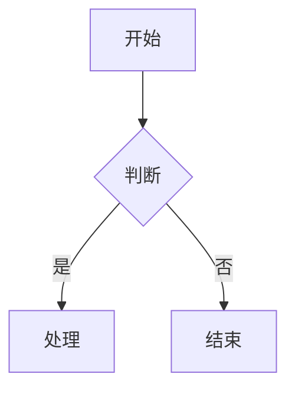

<p align="center">
  
</p>

<h1 align="center">feishu-cli</h1>

<p align="center">
  飞书开放平台命令行工具 — Markdown 与飞书文档双向转换，AI Agent 的飞书操控引擎。
</p>

<p align="center">
  <a href="https://github.com/riba2534/feishu-cli/releases"></a>
  <a href="https://go.dev/"></a>
  <a href="https://github.com/riba2534/feishu-cli/stargazers"></a>
  <a href="https://github.com/riba2534/feishu-cli/blob/main/LICENSE"></a>
</p>

<p align="center">
  <a href="#feishu-cli-是什么">介绍</a> · <a href="#核心能力">核心能力</a> · <a href="#快速开始">快速开始</a> · <a href="#命令参考">命令参考</a> · <a href="#ai-技能集成">AI 技能</a> · <a href="#贡献">贡献</a>
</p>

---

## feishu-cli 是什么

feishu-cli 是一个功能完整的飞书开放平台命令行工具。它将飞书文档、知识库、电子表格、消息、日历、任务等操作封装为简洁的命令行接口，**核心能力是 Markdown ↔ 飞书文档双向无损转换**。

除了传统的 CLI 用法，feishu-cli 还为 [Claude Code](https://claude.ai/claude-code) 等 AI 编程助手提供了 **28 个开箱即用的技能文件**，让 AI Agent 能够直接创建文档、发送消息、管理权限 — 无需任何额外配置。

> **注意**：feishu-cli 主要面向 AI Agent（如 Claude Code）使用，通过技能文件让 AI 直接操控飞书。虽然人类也可以直接使用命令行，但大多数场景下建议通过 AI Agent 调用，体验更佳。

### 为什么选择 feishu-cli

- **双向转换零损耗** — 支持 40+ 种块类型，Markdown 导入飞书后再导出，内容完整保留
- **图表原生渲染** — Mermaid（8 种图表类型）和 PlantUML 自动转换为飞书画板，不是截图，是可编辑的矢量图
- **大规模文档处理** — 三阶段并发管道架构，实测 10,000+ 行 / 127 个图表 / 170+ 个表格一次导入
- **P2P 私聊原生可读** — `msg history --user-email` 一条命令打通「搜用户 → 反查 p2p chat_id → 读消息」，输出自动带 `sender_names` 映射，AI Agent 直接拿结构化带名消息流，无需额外查群成员
- **AI Agent 原生** — 28 个技能文件覆盖飞书全功能，AI 助手即装即用
- **一个工具覆盖全平台** — 文档、知识库、表格、多维表格、消息、邮箱、日历、任务、考勤、OKR、视频会议、妙记、云盘、权限、画板、Slides、事件、Schema、Profile、健康检查

## 核心能力

### Markdown ↔ 飞书文档

将本地 Markdown 文件一键上传到飞书，或将飞书文档导出为 Markdown。支持完整语法转换：

```bash
# 导入：Markdown → 飞书文档
feishu-cli doc import report.md --title "技术报告" --verbose

# 导出：飞书文档 → Markdown
feishu-cli doc export <document_id> -o doc.md --download-images
```

**支持的语法**：标题（6 级）、段落、列表（无限深度嵌套）、任务列表、代码块、引用、Callout（6 种类型）、表格（自动拆分）、分割线、图片、链接、公式、粗体 / 斜体 / 删除线 / 下划线 / 行内代码 / 高亮

### Mermaid / PlantUML 图表

Markdown 中的 Mermaid 和 PlantUML 代码块**自动转换为飞书画板**（可编辑矢量图，非截图）：

````markdown

````

| 图表类型 | 声明 | 说明 |
|---------|------|------|
| 流程图 | `flowchart TD` / `flowchart LR` | 支持 subgraph |
| 时序图 | `sequenceDiagram` | 参与者建议 ≤ 8 |
| 类图 | `classDiagram` | |
| 状态图 | `stateDiagram-v2` | 必须用 v2 |
| ER 图 | `erDiagram` | |
| 甘特图 | `gantt` | |
| 饼图 | `pie` | |
| 思维导图 | `mindmap` | |

PlantUML 同样支持：时序图、活动图、类图、用例图、组件图、ER 图、思维导图等全部类型（` ```plantuml ` 或 ` ```puml `）。

> 实测数据：88 个 Mermaid 图表导入成功率 **93.2%**，失败图表自动降级为代码块。

### 智能表格处理

- **列宽自动计算** — 根据内容智能调整，中英文字符区分宽度（中文 14px，英文 8px）
- **列宽自定义**（v1.29+，issue #156）— 支持紧邻表格上方注释 `<!-- feishu-colwidth: 80,200,*,30% -->`（单位 px / 百分比 / `*` 走 auto）或 CLI flag `--table-column-width=auto|fixed|N1,N2,...` 全局覆盖；注释优先级高于 flag
- **大表格保持单表连贯** — 行数超过飞书 `create_block` 9 行限制时，先创建 9 行初始表，剩余行通过 `insert_table_row` API 追加到同一个 block，视觉上为一张连贯的表，不再拆成多张独立表格
- **批量填充加速**（v1.29+，issue #159）— 单元格填充改用 `batch_update` API（每批 ≤30）+ 文档级 3 QPS 节流，典型 4×6×8 表场景从 ~70s 降到 ~3s
- **单元格多块内容** — 支持 bullet / heading / text 混合内容

### 三阶段并发管道

导入大文档时，feishu-cli 使用三阶段并发管道最大化吞吐量：

1. **阶段一（顺序）** — 按文档顺序创建所有块，收集图表和表格任务
2. **阶段二（并发）** — 图表 worker 池 + 表格 worker 池并发处理
3. **阶段三（逆序）** — 处理失败图表，降级为代码块

```bash
feishu-cli doc import large-doc.md --title "大文档" \
  --upload-images --diagram-workers 5 --table-workers 3 --image-workers 2 --verbose
```

### 全功能 API 覆盖

| 模块 | 能力 |
|------|------|
| **文档** | 创建、导入、导出、编辑、批量更新、Callout、画板、异步导出/导入文件 |
| **知识库** | 空间列表、节点增删改查、导出、空间详情、成员管理 |
| **电子表格** | V2 基础读写 + V3 富文本 API，行列操作、样式、批量样式、合并、查找替换、导出 XLSX/CSV、浮动图片读写、素材上传、单元格写图、筛选视图与筛选条件 CRUD、下拉菜单数据验证 |
| **多维表格** | base/v3 + bitable/v1 全覆盖：数据表/字段/记录 CRUD（含批量获取）、记录附件上传/下载/移除、视图配置（filter/sort/group/visible-fields/timebar/card）、仪表盘 CRUD 与智能排版、仪表盘块 CRUD、表单 CRUD 与分享详情/提交、表单问题 CRUD、角色 CRUD 与协作者管理、高级权限、数据聚合、工作流 CRUD、多维表格重命名与权限设置 |
| **消息** | 发送（text/post/image/file/card 等 11 种类型）、转发、合并转发、回复、Pin、表情回复、消息书签（flag create/list/cancel）、搜索群聊（Bot/User 双身份）、历史记录（群聊 / P2P 私聊，支持 `--user-email` / `--user-id` 自动反查 p2p chat_id）、批量获取、资源下载、话题回复、**发送者名字自动解析**（输出顶层 `sender_names` 映射，覆盖退群成员） |
| **群聊** | 创建、获取、更新、删除、分享链接、成员管理 |
| **邮箱** | 收件箱分类/搜索、邮件详情（单条/批量/线程）、发送（默认草稿，支持 CID 内联图片自动扫描）、草稿管理、回复/全部回复/转发、邮件模板 create/list、邮箱签名查看（需 User Token） |
| **日历** | 日历列表、主日历、日程增删改查、搜索、回复邀请、参与者管理、忙闲查询、日程视图（agenda）、智能时段建议、会议室查找、RSVP |
| **任务** | 创建、查看、完成、重新打开、子任务、成员管理、提醒、评论、我的任务、任务清单（CRUD + 任务关联 + 成员管理） |
| **视频会议** | 多维搜索（query/主持人/参会者/会议室）、会议纪要（三路径批量获取 + AI 产物 + 逐字稿下载）、录制查询、会议机器人入会/离会/会议事件（需 User Token） |
| **妙记** | 妙记详情 + AI 产物（摘要/待办/章节）、音视频媒体批量下载（SSRF 防护 + 速率限制）（需 User Token） |
| **审批** | 审批定义与实例详情查询、当前登录用户审批任务查询（待办 / 已办 / 已发起 / 抄送）、发起/撤回/抄送审批实例、通过/拒绝/转交审批任务 |
| **考勤** | 查询用户打卡记录与日/月度考勤统计（tenant token，日期范围最长 31 天） |
| **OKR** | 周期列表、目标/关键结果进展记录列表与创建 |
| **权限** | 添加 / 更新 / 删除协作者、批量添加、公开权限管理、分享密码、权限检查、转移所有权 |
| **云盘增强** | 大文件分块上传（>20MB 自动分片）、流式下载、异步导出（docx→markdown 快捷路径 + sheet/bitable CSV）、异步导入、文件夹移动（自动轮询）、富文本评论（wiki URL 解析）、异步任务查询 |
| **原生 Markdown 文件** | Drive `.md` 文件 create/fetch/overwrite，整体保留 Markdown 源码，不转换为飞书 docx 块；本地比对远端最新与历史版本 |
| **文件** | 云空间文件列表、创建、移动、复制、删除、上传、下载、版本管理、元数据、统计 |
| **素材** | 上传 / 下载（图片、文件、音视频） |
| **画板** | 精排绘图（create-notes）、Mermaid / PlantUML 导入、截图下载、节点管理 |
| **Slides** | 创建空白演示文稿、上传媒体到演示文稿 |
| **评论** | 列出、添加、解决/恢复评论、回复管理 |
| **搜索** | 消息搜索（默认返回消息 ID，`--enrich` 补全内容/发送者/群名/时间）、应用搜索、文档搜索（需 User Access Token） |
| **用户** | 获取用户信息、用户搜索、部门用户列表 |
| **通讯录** | 部门详情、子部门列表 |
| **实时事件** | WebSocket 长连接订阅应用事件，支持 EventKey 列表/schema/consume/status/stop |
| **Raw API** | `api GET/POST/PUT/DELETE/PATCH <path>` 裸调任意未封装的 OpenAPI 接口，自动鉴权与错误码处理，支持 dry-run、自定义超时、jq 过滤与 json/pretty/table/ndjson/csv 多格式输出 |
| **OpenAPI Schema** | 本地查询内置 OpenAPI service/resource/method、路径、参数和 scope，无需 token |
| **Profile 多配置** | 多 App / 多账号配置 add/list/use/current/rename/remove/migrate，支持 `FEISHU_PROFILE` 临时切换 |
| **健康检查** | `doctor` 一次检查配置、User Token、端点、代理和本地依赖 |

## 快速开始

### 安装

**一键安装（推荐）**

自动检测平台，下载最新版本并安装到 `/usr/local/bin`：

```bash
curl -fsSL https://raw.githubusercontent.com/riba2534/feishu-cli/main/install.sh | bash
```

已安装的用户执行同样的命令即可更新到最新版本。

<details>
<summary>其他安装方式</summary>

**手动下载**

从 [Releases](https://github.com/riba2534/feishu-cli/releases/latest) 页面下载对应平台的压缩包：

| 平台 | 文件 |
|------|------|
| Linux x64 | `feishu-cli_*_linux-amd64.tar.gz` |
| Linux ARM64 | `feishu-cli_*_linux-arm64.tar.gz` |
| macOS Intel | `feishu-cli_*_darwin-amd64.tar.gz` |
| macOS Apple Silicon | `feishu-cli_*_darwin-arm64.tar.gz` |
| Windows x64 | `feishu-cli_*_windows-amd64.tar.gz` |

```bash
tar -xzf feishu-cli_*_linux-amd64.tar.gz
sudo mv feishu-cli_*/feishu-cli /usr/local/bin/
```

**使用 go install**

```bash
go install github.com/riba2534/feishu-cli@latest
```

**从源码编译**

```bash
git clone https://github.com/riba2534/feishu-cli.git
cd feishu-cli && make build
# 二进制文件输出到 bin/feishu-cli
```

</details>

### 配置凭证

**一键创建应用（推荐）**

无需手动访问飞书开放平台后台，一条命令自动完成应用注册：

```bash
# 自动创建飞书应用并保存凭证到 ~/.feishu-cli/config.yaml
feishu-cli config create-app --save
```

执行后终端会输出一个授权链接，用飞书扫码确认即可。CLI 自动获取 App ID 和 App Secret 并写入配置文件，后续命令直接可用。

然后在飞书开放平台的**应用权限管理**页面为新创建的应用开通所需 scope。最快的方式是复制 [权限要求](#权限要求) 章节的 JSON，在权限管理页面的 **导入权限** 入口粘贴即可一次性申请全部。

<details>
<summary>手动配置（不推荐）</summary>

如果你有特殊需求（如企业应用、自定义应用类型），也可以手动配置：

1. 在 [飞书开放平台](https://open.feishu.cn/app) 创建应用，获取 App ID 和 App Secret
2. 给应用添加所需权限（参见[权限要求](#权限要求)）
3. 配置凭证（二选一）：

```bash
# 方式一：环境变量
export FEISHU_APP_ID="cli_xxx"
export FEISHU_APP_SECRET="xxx"

# 方式二：配置文件
feishu-cli config init  # 生成模板后手动编辑填入凭证
```

</details>

（可选）如果需要使用搜索、审批任务查询等需要用户身份的功能，还需完成 OAuth 用户授权：

```bash
feishu-cli auth login
```

### 验证安装

```bash
feishu-cli doc create --title "Hello Feishu"
```

如果返回文档 ID，说明配置成功。

## 命令参考

```
feishu-cli <command> [subcommand] [flags]

Commands:
  doc       文档操作（创建、导入、导出、编辑、异步导出/导入文件）
  wiki      知识库操作（节点增删改查、空间详情、成员管理）
  sheet     电子表格（读写、样式、batch-set-style、V3 富文本 API、导出 XLSX/CSV、image、filter-view + condition、dropdown）
  bitable   多维表格（base/v3 + bitable/v1：数据表/字段/记录/附件/视图/仪表盘/表单/角色/权限/聚合/工作流，87 命令）
  msg       消息操作（发送、转发、合并转发、回复、Pin、表情回复、书签、批量获取、资源下载）
  chat      群聊管理（创建、更新、删除、成员管理）
  mail      邮箱操作（分类/搜索、发送、草稿、回复、转发、CID 内联图片、模板、签名）
  drive     云盘增强（分块上传、流式下载、异步导出/导入、移动、评论，8 命令）
  markdown  Drive 原生 Markdown 文件 CRUD（.md 整体读写、版本比对，不转换 docx 块）
  vc        视频会议（多维搜索、纪要、录制查询、会议机器人入会/离会/事件）
  minutes   妙记操作（详情 + AI 产物、媒体批量下载）
  apps      妙搭（Miaoda）应用（创建、发布 HTML、修改、访问范围管理）
  file      文件管理（列出、移动、复制、删除、上传、下载、版本管理）
  media     素材操作（上传、下载）
  perm      权限管理（添加、删除、批量添加、公开权限、密码、转移所有权）
  calendar  日历操作（日程增删改查、搜索、参与者、忙闲查询、agenda、suggestion、room-find、rsvp）
  task      任务操作（增删改查、子任务、成员、提醒、评论、我的任务）
  tasklist  任务清单管理（CRUD、任务关联、成员管理）
  attendance 考勤操作（打卡记录查询、统计数据查询）
  okr       OKR 操作（周期列表、进展记录列表与创建）
  slides    Slides 演示文稿（创建、媒体上传）
  user      用户操作（获取信息、搜索、部门用户列表）
  dept      部门操作（详情、子部门列表）
  board     画板操作（导入图表、下载图片）
  comment   评论操作（列出、添加、解决/恢复、回复管理）
  approval  审批操作（定义/实例详情、任务查询、实例创建/撤回/抄送、任务通过/拒绝/转交）
  search    搜索操作（消息、应用、文档）
  event     实时事件订阅（WebSocket 长连接、list/schema/consume/status/stop）
  schema    本地浏览飞书 OpenAPI 方法（无需 token）
  api       通用 OpenAPI 透传调用（任意 method/path，自动鉴权 + 错误码翻译，覆盖 2500+ 端点）
  profile   多 App / 多账号配置切换
  doctor    环境健康检查（config/user_token/endpoints/proxy/deps）
  auth      身份认证（OAuth 登录、状态、退出、scope 预检）
  config    配置管理
```

<details>
<summary>文档操作</summary>

```bash
# 创建文档
feishu-cli doc create --title "新文档"

# 导入 Markdown（核心功能，默认上传图片）
feishu-cli doc import doc.md --title "文档标题" --upload-images --verbose

# 导出为 Markdown
feishu-cli doc export <doc_id> -o output.md --download-images
# 导出他人文档（自动从 auth login 读取 User Token，或手动指定）
feishu-cli doc export <doc_id> -o output.md --user-access-token <token>

# 获取文档信息
feishu-cli doc get <doc_id>

# 获取所有块
feishu-cli doc blocks <doc_id> --all

# 添加内容（JSON 格式）
feishu-cli doc add <doc_id> -c '<JSON>'

# 添加内容（Markdown 格式）
feishu-cli doc add <doc_id> README.md --content-type markdown

# 添加高亮块
feishu-cli doc add-callout <doc_id> "提示内容" --callout-type info

# 批量更新
feishu-cli doc batch-update <doc_id> '[...]' --source-type content

# 异步导出为文件（PDF/DOCX/XLSX）
feishu-cli doc export-file <doc_token> --type pdf -o output.pdf

# 异步导入本地文件为飞书文档
feishu-cli doc import-file local_file.docx --type docx --name "文档名"
```

</details>

<details>
<summary>知识库操作</summary>

```bash
feishu-cli wiki spaces                              # 列出知识空间
feishu-cli wiki get <node_token>                    # 获取节点
feishu-cli wiki nodes <space_id>                    # 列出节点
feishu-cli wiki export <node_token> -o doc.md       # 导出为 Markdown
feishu-cli wiki export-tree <node_token> -o ./backup  # 递归导出知识库子树
feishu-cli wiki create --space-id <id> --title "新节点"
feishu-cli wiki move-docs <obj_token> --space-id <id>  # 移动云空间文档至知识空间
feishu-cli wiki space-get <space_id>                # 获取知识空间详情
feishu-cli wiki space-create --name "新知识库"      # 创建知识库（v1.29+）
feishu-cli wiki space-list --page-all -o json       # 列出所有可见知识库（v1.29+）
feishu-cli wiki node-copy --space-id <src> --node-token <node> --target-space-id <dst>  # 复制节点（v1.29+）
feishu-cli wiki delete-space <space_id> --yes       # 删除整个知识空间（异步任务自动轮询）

# 知识空间成员管理
feishu-cli wiki member add <space_id> --member-type userid --member-id USER_ID --role admin
feishu-cli wiki member list <space_id>
feishu-cli wiki member remove <space_id> --member-type userid --member-id USER_ID --role admin
```

</details>

<details>
<summary>电子表格操作</summary>

```bash
# V2 API - 基础读写
feishu-cli sheet read <token> "Sheet1!A1:C10"
feishu-cli sheet write <token> "Sheet1!A1:B2" --data '[["姓名","年龄"],["张三",25]]'

# V3 API - 富文本支持
feishu-cli sheet read-rich <token> <sheet_id> "sheet!A1:C10"
feishu-cli sheet write-rich <token> <sheet_id> --data-file data.json

# 行列操作
feishu-cli sheet add-rows <token> <sheet_id> --count 5
feishu-cli sheet add-cols <token> <sheet_id> --count 3

# 样式与合并
feishu-cli sheet style <token> "Sheet1!A1:C3" --bold --font-size 14
feishu-cli sheet merge <token> "Sheet1!A1:C1"
```

</details>

<details>
<summary>消息操作</summary>

```bash
# 发送文本消息
feishu-cli msg send --receive-id-type email --receive-id user@example.com --text "Hello"

# 发送富文本消息
feishu-cli msg send --receive-id-type email --receive-id user@example.com \
  --msg-type post --content-file msg.json

# 搜索群聊（Bot 身份，仅返回 Bot 所在的群）
feishu-cli msg search-chats --query "关键词"

# 搜索群聊（User 身份，可搜到用户所在的群）
feishu-cli msg search-chats --query "关键词" --user-access-token <token>

# 获取群聊历史消息（已 auth login 时自动用 User Token；未登录回落 Bot Token，要求 Bot 在群里）
feishu-cli msg history --container-id <chat_id> --container-id-type chat

# 获取和某人的私聊记录（邮箱入口，自动搜用户 + 反查 p2p chat_id）
feishu-cli msg history --user-email user@example.com --page-size 50 -o json

# 已知 open_id 时直接传
feishu-cli msg history --user-id ou_xxx --page-size 50 -o json

# 输出 JSON 自动携带顶层 sender_names 映射（open_id → 姓名），AI Agent 可直接引用
# {"items":[...], "sender_names":{"ou_abc":"张三","ou_def":"李四"}}

# 转发消息
feishu-cli msg forward <message_id> --receive-id <id> --receive-id-type email

# 回复消息
feishu-cli msg reply <message_id> --text "回复内容"

# 合并转发
feishu-cli msg merge-forward --receive-id user@example.com --receive-id-type email --message-ids id1,id2

# 消息加急
feishu-cli msg urgent <message_id> --user-id-type open_id --user-ids ou_xxx,ou_yyy
feishu-cli msg urgent <message_id> --urgent-type phone --user-id-type user_id --user-ids u_123,u_456
feishu-cli msg urgent <message_id> --urgent-type sms --user-id-type union_id --user-ids on_xxx,on_yyy

# 表情回复
feishu-cli msg reaction add <message_id> --emoji-type THUMBSUP
feishu-cli msg reaction remove <message_id> --reaction-id REACTION_ID
feishu-cli msg reaction list <message_id>

# Pin 消息
feishu-cli msg pin <message_id>
feishu-cli msg unpin <message_id>
feishu-cli msg pins --chat-id CHAT_ID
```

</details>

<details>
<summary>权限管理</summary>

```bash
# 添加 / 更新协作者
feishu-cli perm add <doc_id> --doc-type docx --member-type email \
  --member-id user@example.com --perm full_access --notification
feishu-cli perm update <doc_id> --doc-type docx --member-type email \
  --member-id user@example.com --perm edit

# 查看 / 删除协作者
feishu-cli perm list <doc_token> --doc-type docx
feishu-cli perm delete <doc_token> --doc-type docx --member-type email --member-id user@example.com

# 公开权限管理
feishu-cli perm public-get <doc_token>
feishu-cli perm public-update <doc_token> --external-access --link-share-entity anyone_readable

# 分享密码
feishu-cli perm password create <doc_token>
feishu-cli perm password delete <doc_token>

# 批量添加协作者
feishu-cli perm batch-add <doc_token> --members-file members.json --notification

# 权限检查
feishu-cli perm auth <doc_token> --action view

# 转移所有权
feishu-cli perm transfer-owner <doc_token> --member-type email --member-id user@example.com
```

</details>

<details>
<summary>群聊管理</summary>

```bash
# 群聊 CRUD
feishu-cli chat create --name "群聊名" --user-ids id1,id2
feishu-cli chat get <chat_id>
feishu-cli chat update <chat_id> --name "新群名"
feishu-cli chat delete <chat_id>
feishu-cli chat link <chat_id>

# 群成员管理
feishu-cli chat member list <chat_id>
feishu-cli chat member add <chat_id> --id-list id1,id2
feishu-cli chat member remove <chat_id> --id-list id1,id2
```

</details>

<details>
<summary>文件管理</summary>

```bash
# 基础操作
feishu-cli file list [folder_token]
feishu-cli file mkdir "新文件夹" --parent <folder_token>

# 上传 / 下载
feishu-cli file upload local_file.pdf --parent FOLDER_TOKEN
feishu-cli file download <file_token> -o output.pdf
feishu-cli file download <file_token> -o large.zip --user-access-token u-xxx --timeout 30m  # 大文件自动 Range 分片兜底

# 版本管理
feishu-cli file version list <doc_token> --doc-type docx
feishu-cli file version create <doc_token> --doc-type docx --name "v1.0"
feishu-cli file version get <doc_token> <version_id> --doc-type docx
feishu-cli file version delete <doc_token> <version_id> --doc-type docx

# 元数据与统计
feishu-cli file meta TOKEN1 TOKEN2 --doc-type docx
feishu-cli file stats <file_token> --doc-type docx
```

</details>

<details>
<summary>搜索操作</summary>

搜索 API 需要 User Access Token。推荐使用 `auth login` 一键获取（Token 自动保存和刷新），也可通过 `--user-access-token` 参数或环境变量手动指定。

```bash
# 获取 User Access Token（推荐，一次登录自动刷新）
feishu-cli auth login

# 搜索消息（默认返回消息 ID，-o json 输出 {MessageIDs,HasMore,PageToken}）
feishu-cli search messages "关键词"
feishu-cli search messages "会议" --chat-ids oc_xxx,oc_yyy
feishu-cli search messages "你好" --chat-type p2p_chat  # 搜索私聊消息
feishu-cli search messages "会议" --enrich  # 补全内容/发送者/群名/时间

# 搜索应用
feishu-cli search apps "审批"

# 搜索文档和 Wiki
feishu-cli search docs "产品需求"
feishu-cli search docs "季度报告" --docs-types doc,sheet
feishu-cli search docs "技术方案" --count 10 --offset 0

# 也可以手动指定 Token
feishu-cli search docs "产品需求" --user-access-token <token>
export FEISHU_USER_ACCESS_TOKEN="u-xxx"
feishu-cli search docs "产品需求"
```

</details>

<details>
<summary>审批操作</summary>

`approval get` 使用应用权限查询审批定义（审批模板/流程定义），支持 `--output raw-json` 查看飞书 API 原始响应，需要开通 `approval:approval:readonly`；`approval instance get` 对齐官方 `instances/uat_get`，必须使用 User Token，需要开通 `approval:instance:read`；`approval task query` 对齐官方 `tasks/uat_query`，必须使用 User Token，需要开通 `approval:task:read`。审批写流程覆盖 `instance create/cancel/cc`、`task approve/reject/transfer`；其中 `instance create` 是本项目额外应用态能力，其余写命令均对齐官方 `uat_*` 用户态接口。

输出说明：
- 不传 `--output`：输出便于阅读的文本摘要
- `--output json`：输出 CLI 归一化后的 JSON，部分字段会做拍平和字符串化处理
- `--output raw-json`：输出飞书 API 原始响应，便于排查字段差异

```bash
# 查询审批定义详情（审批模板/流程定义）
feishu-cli approval get <approval_code>

# 输出完整 JSON
feishu-cli approval get <approval_code> --output json

# 输出飞书 API 原始响应
feishu-cli approval get <approval_code> --output raw-json

# 查询审批实例详情（User Token）
feishu-cli approval instance get --instance-code <instance_code>
feishu-cli approval instances get --instance-code <instance_code> --output raw-json

# 查询当前登录用户的待我审批
feishu-cli approval task query --topic todo

# 查询我已审批的任务
feishu-cli approval task query --topic done

# 查询我发起的审批
feishu-cli approval task query --topic started --output json

# 输出飞书 API 原始响应
feishu-cli approval task query --topic started --output raw-json

# 翻页查询
feishu-cli approval task query --topic todo --page-size 20 --page-token <token>

# 显式指定 User Access Token
feishu-cli approval task query --topic cc-unread --user-access-token <token>

# 发起审批实例（form.json 为飞书审批表单 JSON 数组）
feishu-cli approval instance create --approval-code <code> --user-id ou_xxx --form-file form.json

# 撤回 / 抄送审批实例
feishu-cli approval instance cancel --instance-code <instance_code>
feishu-cli approval instance cc --instance-code <instance_code> --cc-user-ids ou_a,ou_b

# 通过 / 拒绝审批任务
feishu-cli approval task approve --instance-code <instance_code> --task-id <task_id> --comment "同意"
feishu-cli approval task reject --instance-code <instance_code> --task-id <task_id> --comment "信息不完整"

# 转交审批任务（User Token）
feishu-cli approval task transfer --instance-code <instance_code> --task-id <task_id> --transfer-user-id ou_target --comment "请代审"
```

</details>

<details>
<summary>身份认证（Device Flow）</summary>

通过 **OAuth 2.0 Device Flow（RFC 8628）** 获取 User Access Token，用于搜索、审批待办查询等需要用户授权的功能。**无需在飞书开放平台配置任何重定向 URL 白名单**。

> **v1.18+ 变更**：Authorization Code Flow（`--print-url` / `auth callback` / `--manual` / `--port` / `--method` / `--scopes`）已全部删除，只保留 Device Flow。

```bash
# 按业务域申请推荐权限（推荐）
feishu-cli auth login --domain search --recommend

# 显式申请某组 scope
feishu-cli auth login --scope "minutes:minutes.basic:read minutes:minutes.transcript:export"

# JSON 事件流输出（AI Agent 推荐，配合 run_in_background 使用）
feishu-cli auth login --domain search --recommend --json

# 两步模式：先立即输出 device_code，不启动轮询
feishu-cli auth login --domain vc --domain minutes --recommend --no-wait --json

# 两步模式：用已有 device_code 继续轮询
feishu-cli auth login --device-code <device_code> --json

# 预检 token 是否包含所需 scope（AI Agent 推荐在执行业务命令前调用）
feishu-cli auth check --scope "search:docs:read"
feishu-cli auth check --scope "search:docs:read im:message:readonly"

# 查看当前授权状态
feishu-cli auth status
feishu-cli auth status -o json  # JSON 格式输出

# 退出登录（清除本地 token）
feishu-cli auth logout
```

登录时 CLI 在 stderr 打印验证链接和 user_code，用户在任意设备（电脑、手机）浏览器打开链接完成授权即可。本地桌面会尝试自动打开浏览器，SSH 远程失败静默忽略。

**授权范围策略**：
- CLI 会显式声明本次请求的 scope，不再依赖“后台开了什么就全量返回”
- 推荐先用 `auth check --scope "REQ_SCOPES"` 预检，再用 `auth login --scope "..."` 或 `auth login --domain ... --recommend` 补授权
- 即使显式请求业务 scope，CLI 也会自动追加最小核心 scope（如 `auth:user.id:read`）用于识别当前登录用户
- 要真正拿到某个 scope，仍然必须先在飞书开放平台应用权限管理页面开通它

**Token 管理**：
- Token 保存在 `~/.feishu-cli/token.json`，Access Token 有效期约 2 小时
- Access Token 过期时自动使用 Refresh Token 刷新（Refresh Token 有效期 30 天）
- `offline_access` 由 CLI 自动追加，无需手动声明
- Token 优先级：`--user-access-token` 参数 > `FEISHU_USER_ACCESS_TOKEN` 环境变量 > `token.json` > `config.yaml`
- 审批任务查询会缓存当前登录用户资料到 `~/.feishu-cli/user_profile.json`，登录态变化或执行 `auth logout` 时会自动清理

</details>

<details>
<summary>更多命令</summary>

```bash
# 文档异步导出/导入
feishu-cli doc export-file <doc_token> --type pdf -o output.pdf
feishu-cli doc import-file local_file.docx --type docx --name "文档名"

# 素材上传
feishu-cli media upload image.png --parent-type docx_image --parent-node <doc_id>

# 日历
feishu-cli calendar list
feishu-cli calendar get <calendar_id>
feishu-cli calendar primary
feishu-cli calendar create-event --calendar-id <id> --summary "会议" \
  --start "2024-01-01T10:00:00+08:00" --end "2024-01-01T11:00:00+08:00"
feishu-cli calendar event-search --calendar-id <id> --query "关键词"
feishu-cli calendar event-reply <calendar_id> <event_id> --status accept
feishu-cli calendar attendee add <calendar_id> <event_id> --user-ids id1,id2
feishu-cli calendar attendee list <calendar_id> <event_id>
feishu-cli calendar freebusy --start "2024-01-01T00:00:00+08:00" \
  --end "2024-01-02T00:00:00+08:00" --user-ids id1,id2

# 任务
feishu-cli task create --summary "待办事项"
feishu-cli task complete <task_id>
feishu-cli task subtask create <task_guid> --summary "子任务"
feishu-cli task subtask list <task_guid>
feishu-cli task member add <task_guid> --members id1,id2 --role assignee
feishu-cli task reminder add <task_guid> --minutes 30
feishu-cli task upload-attachment --task-guid <task_guid> --file ./report.pdf

# 任务列表
feishu-cli tasklist create --name "任务列表"
feishu-cli tasklist list
feishu-cli tasklist get <tasklist_guid>
feishu-cli tasklist delete <tasklist_guid>

# 画板（v1.25+ 新增 5 个子命令 + Mermaid 本地引擎 + Markdown ```svg fence 自动识别）
feishu-cli board create-notes <whiteboard_id> nodes.json -o json  # 精排绘图（JSON 控制坐标、颜色、连线）
feishu-cli board import <whiteboard_id> "graph TD; A-->B" --source-type content --syntax mermaid --diagram-type flowchart  # 服务端渲染
feishu-cli board import <whiteboard_id> diagram.mmd --syntax mermaid --engine local  # 本地引擎（whiteboard-cli 翻译，每个节点可单独编辑）
feishu-cli board import <whiteboard_id> diagram.puml --syntax plantuml  # 导入 PlantUML
feishu-cli board svg-import <whiteboard_id> drawing.svg            # 单 svg 节点装饰（图标/印章 < 2KB）
feishu-cli board clone <source_id> <target_id> --batch-size 10    # 克隆画板（含 connector ID 重映射 + 分批节流）
feishu-cli board upload-image <whiteboard_id> photo.png           # 上传本地图片为 image 节点（自动推断像素尺寸）
feishu-cli board lint <whiteboard_id>                              # 几何质检（重叠/字号一致性/容量/综合评分）
feishu-cli board export-code <whiteboard_id> --merge --output-path design.svg  # 反向导出 SVG（按 z_index 排序）
feishu-cli board update <whiteboard_id> nodes.json --overwrite --snapshot old.json  # 覆盖更新+快照备份
feishu-cli board nodes <whiteboard_id>                            # 获取画板所有节点
feishu-cli board image <whiteboard_id> output.png                 # 下载画板截图
# ⭐ AI 自由作图（飞轮/鱼骨/Dashboard/插画/周期表/赛博朋克等）：用 skill 的一键脚本，每个矢量元素都可单独点击编辑
python3 skills/feishu-cli-board/scripts/svg_to_board.py drawing.svg <whiteboard_id>
#   内置 5 步管道：whiteboard-cli 翻译 → 修 z_index → 修剪 viewBox 溢出 → 分批 create-notes → 验证

# 评论
feishu-cli comment list <file_token> --type docx
feishu-cli comment add <file_token> --type docx --text "评论内容"
feishu-cli comment resolve <file_token> <comment_id> --type docx
feishu-cli comment unresolve <file_token> <comment_id> --type docx
feishu-cli comment reply list <file_token> <comment_id> --type docx
feishu-cli comment reply delete <file_token> <comment_id> <reply_id> --type docx

# 多维表格（base/v3 API）
feishu-cli bitable create --name "项目管理" --time-zone Asia/Shanghai
feishu-cli bitable table list --base-token bscnxxxx
feishu-cli bitable table create --base-token bscnxxxx --name "任务"
feishu-cli bitable field list --base-token bscnxxxx --table-id tblxxx
feishu-cli bitable field create --base-token bscnxxxx --table-id tblxxx --config '{"name":"状态","type":"select"}'
feishu-cli bitable record upsert --base-token bscnxxxx --table-id tblxxx --config '{"fields":{"名称":"测试"}}'
feishu-cli bitable record upsert --base-token bscnxxxx --table-id tblxxx --record-id recxxx --config '{"fields":{"状态":"完成"}}'
feishu-cli bitable record batch-create --base-token bscnxxxx --table-id tblxxx --config '{"fields":["fld1"],"rows":[["val1"],["val2"]]}'
feishu-cli bitable record batch-delete --base-token bscnxxxx --table-id tblxxx --record-ids rec_1,rec_2,rec_3
feishu-cli bitable record batch-get    --base-token bscnxxxx --table-id tblxxx --record-ids rec_1,rec_2  # 批量获取记录
feishu-cli bitable record share-link   --base-token bscnxxxx --table-id tblxxx --record-ids rec_1,rec_2  # 批量共享链接（v1.29+）
feishu-cli bitable record list --base-token bscnxxxx --table-id tblxxx
feishu-cli bitable view list --base-token bscnxxxx --table-id tblxxx
feishu-cli bitable view view-filter-get --base-token bscnxxxx --table-id tblxxx --view-id vewxxx
feishu-cli bitable role list --base-token bscnxxxx

# 记录附件（上传 / 下载 / 移除）
feishu-cli bitable record upload-attachment --base-token bscnxxxx --table-id tblxxx \
  --record-id recxxx --field-id fldxxx --file ./report.pdf --file ./shot.png
feishu-cli bitable record download-attachment --base-token bscnxxxx --table-id tblxxx \
  --record-id recxxx --output ./downloads/
feishu-cli bitable record remove-attachment --base-token bscnxxxx --table-id tblxxx \
  --record-id recxxx --field-id fldxxx --file-token boxcnxxxx

# 仪表盘（CRUD + 智能排版 + 仪表盘块）
feishu-cli bitable dashboard create --base-token bscnxxxx --name "运营看板"
feishu-cli bitable dashboard block create --base-token bscnxxxx --dashboard-id dsbxxxx \
  --type column --name "按月统计" --data-config '{"table_name":"任务","group_by":"月份"}'
feishu-cli bitable dashboard arrange --base-token bscnxxxx --dashboard-id dsbxxxx

# 表单（CRUD + 分享 token 详情/提交 + 表单问题）
feishu-cli bitable form create --base-token bscnxxxx --table-id tblxxx --name "报名表"
feishu-cli bitable form field create --base-token bscnxxxx --table-id tblxxx --form-id vewxxx \
  --questions '[{"type":"text","title":"你的名字","required":true}]'
feishu-cli bitable form detail --share-token shrcnxxxx                          # 无需 base_token
feishu-cli bitable form submit --share-token shrcnxxxx --content '{"评分":5,"评价":"很好"}'

# 角色协作者（member list/create/delete/batch-create/batch-delete）
feishu-cli bitable role member list   --base-token bscnxxxx --role-id rolxxxx
feishu-cli bitable role member create --base-token bscnxxxx --role-id rolxxxx --member-id ou_xxx --member-id-type open_id
feishu-cli bitable role member delete --base-token bscnxxxx --role-id rolxxxx --member-id ou_xxx --member-id-type open_id
feishu-cli bitable role member batch-create --base-token bscnxxxx --role-id rolxxxx --member-ids ou_a,ou_b --member-id-type open_id

# 多维表格元信息更新（重命名 / 高级权限开关）
feishu-cli bitable update --base-token bscnxxxx --name "新表名"           # 重命名
feishu-cli bitable update --base-token bscnxxxx --is-advanced             # 开启高级权限（--is-advanced=false 关闭）

# 工作流（list/get/create/update/enable/disable；update 为整体替换 PUT）
feishu-cli bitable workflow list    --base-token bscnxxxx
feishu-cli bitable workflow get     --base-token bscnxxxx --workflow-id wkfxxxx
feishu-cli bitable workflow update  --base-token bscnxxxx --workflow-id wkfxxxx --config-file wf.json
feishu-cli bitable workflow enable  --base-token bscnxxxx --workflow-id wkfxxxx
feishu-cli bitable workflow disable --base-token bscnxxxx --workflow-id wkfxxxx

# 云盘增强（drive）
feishu-cli drive upload --file big.zip --folder-token fldxxx
feishu-cli drive download --file-token boxxxx --output ./downloads/ --overwrite
feishu-cli drive download --file-token boxxxx --output ./big.zip --timeout 30m  # 大文件自动 Range 分片兜底
feishu-cli drive export --token docxxxx --doc-type docx --file-extension markdown --output-dir ./exports
feishu-cli drive export --token sheetxxxx --doc-type sheet --file-extension csv --sub-id sheet_1 --output-dir ./out
feishu-cli drive import --file report.docx --type docx --folder-token fldxxx
feishu-cli drive move --file-token fldxxx --type folder --folder-token fldyyy
feishu-cli drive add-comment --doc docxxx --content '[{"type":"text","text":"评论"}]'

# v1.29+ 新增 ⭐
feishu-cli drive inspect --url "https://xxx.feishu.cn/docx/doxxxx"      # 解析 URL → type/title/token
feishu-cli drive apply-permission --token "<url|token>" --perm view --remark "申请理由"  # 向 owner 发申请

# 云盘 ↔ 本地单向镜像（pull/push/status）
feishu-cli drive status --folder-token fldxxx --local-dir ./mirror
feishu-cli drive pull   --folder-token fldxxx --local-dir ./mirror --if-exists overwrite
feishu-cli drive push   --folder-token fldxxx --local-dir ./mirror --if-exists skip
feishu-cli drive pull   --folder-token fldxxx --local-dir ./mirror --delete-local --yes  # 高危：双确认

# 云盘 v2 搜索（扁平 filter；search docs 走 v1，drive search 走 v2）
feishu-cli drive search --query "季度报告" --doc-types DOC,SHEET --sort edit_time
feishu-cli drive search --folder-tokens fldxxx --only-title

# 邮箱（mail，需 User Token）
feishu-cli mail triage --folder INBOX --unread-only --page-size 20
feishu-cli mail triage --query "周会"
feishu-cli mail message --message-id msg_xxx
feishu-cli mail send --to user@example.com --subject "测试" --body "hi"                    # 默认存草稿
feishu-cli mail send --to user@example.com --subject "测试" --body "hi" --confirm-send     # 立即发送
feishu-cli mail send --to user@example.com --subject "周报" --body "$(cat report.html)" \
  --html --inline-images-auto-scan --confirm-send
feishu-cli mail template create --name "周报模板" --subject "本周进度" --body "$(cat template.html)"
feishu-cli mail template list
feishu-cli mail reply --message-id msg_xxx --body "收到" --confirm-send
feishu-cli mail forward --message-id msg_xxx --to team@example.com --body "请关注"
feishu-cli mail signature                                          # 列出邮箱签名
feishu-cli mail signature --detail 7012345678901234567 -o json     # 单个签名详情

# 视频会议（vc）：search/notes/recording 需 User Token；bot meeting-join/leave 默认 Bot/Tenant 身份
feishu-cli vc search --query "周会" --start 2026-03-20 --end 2026-03-28
feishu-cli vc notes --meeting-ids 69xxxx,70xxxx
feishu-cli vc notes --minute-tokens obcnxxxx --with-artifacts --download-transcript --output-dir ./notes
feishu-cli vc recording --meeting-ids 69xxxx
feishu-cli vc bot meeting-join --meeting-number 123456789          # 机器人入会（Bot/Tenant 身份）
feishu-cli vc bot meeting-leave --meeting-id 6911188411932033028   # 机器人离会（Bot/Tenant 身份）
feishu-cli vc bot meeting-events --meeting-id 6911188411932033028 --start 2026-03-01 --end 2026-03-31  # 需 User Token（端点拒收 Tenant）

# 妙记（minutes，需 User Token）
feishu-cli minutes get <minute_token> --with-artifacts
feishu-cli minutes download --minute-tokens obcnxxxx --output ./media
feishu-cli minutes download --minute-tokens obcnxxxx --url-only

# 妙搭（Miaoda）应用 —— 一份 HTML 秒级发布成可分享的飞书应用（需 User Token + spark scope）
feishu-cli auth login --scope "spark:app:read spark:app:write"      # ⚠️ --scope 是替换不是合并，需并入你完整 scope 串
feishu-cli apps create --name "我的页面" --app-type HTML            # 拿 app_id（jq .app.app_id，CLI 已剥掉 data 外层）
feishu-cli apps html-publish --app-id app_xxx --path ./dist         # 打包目录发布，返回 url（jq .url，一键部署）
feishu-cli apps html-publish --app-id app_xxx --path ./index.html   # 单文件形态（文件名必须 index.html）
feishu-cli apps html-publish --app-id app_xxx --path ./dist --dry-run  # 只看打包清单 + 凭证文件扫描
feishu-cli apps access-scope-set --app-id app_xxx --scope tenant    # 组织内可见
feishu-cli apps access-scope-set --app-id app_xxx --scope public --require-login=true
feishu-cli apps access-scope-set --app-id app_xxx --scope specific \
  --targets '[{"type":"user","id":"ou_xxx"},{"type":"chat","id":"oc_xxx"}]'
feishu-cli apps access-scope-get --app-id app_xxx                   # 查看当前访问范围
feishu-cli apps update --app-id app_xxx --name "新名字"

# 日历增强
feishu-cli calendar agenda                                         # 查看今日日程
feishu-cli calendar agenda --start-date 2026-03-28 --end-date 2026-03-29
feishu-cli calendar suggestion --attendee-ids ou_aaa,ou_bbb --duration 30m
feishu-cli calendar room-find --slot 2026-03-28T14:00:00+08:00~2026-03-28T15:00:00+08:00 \
  --city "北京" --min-capacity 6
feishu-cli calendar rsvp --event-id EVENT_xxx --action accept

# 任务增强
feishu-cli task my                                                 # 查看我的任务
feishu-cli task reopen <task_guid>                                 # 重新打开
feishu-cli task comment add <task_guid> --content "评论"
feishu-cli tasklist task-add <tasklist_guid> --task-ids guid1,guid2
feishu-cli tasklist member add <tasklist_guid> --members ou_xxx

# 消息增强
feishu-cli msg mget --message-ids om_xxx,om_yyy
feishu-cli msg resource-download <message_id> <file_key> --type image -o photo.png
feishu-cli msg resource-download <message_id> <file_key> --type file --user-access-token u-xxx -o attachment.bin  # 用户可见但 Bot 不可见的资源
feishu-cli msg resource-download <message_id> <file_key> --type file --user-access-token u-xxx -o large.bin --timeout 30m  # 大文件自动 Range 分片兜底
feishu-cli msg thread-messages <thread_id> --page-size 20
feishu-cli msg flag create om_xxx                                  # 收藏消息
feishu-cli msg flag create om_xxx --flag-type feed                 # feed 层自动识别 thread/msg_thread
feishu-cli msg flag list --page-size 50
feishu-cli msg flag cancel om_xxx                                  # 尽量取消消息层 + feed 层

# interactive 卡片返回原始 schema（不再返回渲染后的 <card title> 文本）
feishu-cli msg get om_xxx --card-content-type user             # userDSL（开发者视角的 schema 2.0 JSON）
feishu-cli msg get om_xxx --card-content-type raw              # cardDSL（平台内部完整描述）
feishu-cli msg mget --message-ids om_xxx,om_yyy --card-content-type user
feishu-cli msg list --container-id oc_xxx --card-content-type user

# 文档增强
feishu-cli doc content-update <doc_id> --mode append --markdown "## 新内容"
feishu-cli doc content-update <doc_id> --mode overwrite --markdown "# 全新文档"
feishu-cli doc content-update <doc_id> --mode replace_range --selection-by-title "## 旧章节" --markdown "## 新章节"
feishu-cli doc media-insert <doc_id> --file photo.png --type image --align center
feishu-cli doc media-download <file_token> -o image.png
feishu-cli doc media-download <file_token> --doc-token DOC_TOKEN --doc-type docx -o image.png

# 妙笔BOX HTML 小组件（文档里跑动画 / ECharts / 可交互图表，唯一能"动"的载体）
feishu-cli doc htmlbox create <doc_id> --html-file widget.html
feishu-cli doc htmlbox update <doc_id> <block_id> --html-file widget-v2.html
feishu-cli doc htmlbox get <doc_id> <block_id> --raw > current.html
feishu-cli doc htmlbox delete <doc_id> <block_id>

# 电子表格导出
feishu-cli sheet export <token> -o output.xlsx
feishu-cli sheet export <token> --format csv --sheet-id SHEET_ID -o output.csv
feishu-cli sheet export <token_or_url> --format markdown -o output.md
feishu-cli sheet filter-view create --spreadsheet-token shtcnxxxx --sheet-id SHEET_ID \
  --range "SHEET_ID!A1:H100" --name "P0 高优"
feishu-cli sheet filter-view list --spreadsheet-token shtcnxxxx --sheet-id SHEET_ID
feishu-cli sheet filter-view update --token shtcnxxxx --sheet-id SHEET_ID \
  --filter-view-id pH9xxxx --name "新名字"
# 筛选条件（按列字母定位）
feishu-cli sheet filter-view condition create --token shtcnxxxx --sheet-id SHEET_ID \
  --filter-view-id pH9xxxx --condition-id E --filter-type number --compare-type less --expected '["6"]'
feishu-cli sheet filter-view condition list --token shtcnxxxx --sheet-id SHEET_ID --filter-view-id pH9xxxx
feishu-cli sheet dropdown set --token shtcnxxxx --range "SHEET_ID!B2:B100" \
  --options "待办,处理中,已完成"
feishu-cli sheet dropdown update --token shtcnxxxx --sheet-id SHEET_ID \
  --ranges "SHEET_ID!A1:A100" --options "P0,P1,P2" --multiple --colors "#FF4D4F,#FAAD14,#52C41A"
feishu-cli sheet dropdown get --token shtcnxxxx --range "SHEET_ID!A1:A100"
feishu-cli sheet dropdown delete --token shtcnxxxx --ranges "SHEET_ID!A1:A100"
# 浮动图片 / 单元格写图 / 批量样式
feishu-cli sheet image media-upload shtcnxxxx ./logo.png                     # 返回 file_token
feishu-cli sheet image write-image shtcnxxxx SHEET_ID --range "A1" --image ./logo.png
feishu-cli sheet batch-set-style shtcnxxxx \
  --data '[{"ranges":["SHEET_ID!A1:A2"],"style":{"font":{"bold":true},"backColor":"#FF0000"}}]'

# Drive 原生 Markdown 文件（不做 docx 块转换）
feishu-cli markdown create --name README.md --content-file ./README.md --folder-token fldxxx
feishu-cli markdown create --file ./README.md --folder-token fldxxx
feishu-cli markdown fetch --file-token boxcnxxx --output-path ./remote.md
feishu-cli markdown overwrite --file-token boxcnxxx --file ./remote.md
feishu-cli markdown diff --file-token boxcnxxx --file ./local.md               # 远端最新 vs 本地
feishu-cli markdown diff --file-token boxcnxxx --from-version 2 --to-version 5  # 远端版本 A vs B

# 用户
feishu-cli user info <user_id>
feishu-cli user search --email user@example.com         # 邮箱查 user_id；带 User Token 时自动补 open_id + 姓名
feishu-cli user search --mobile 13800138000
feishu-cli user search --query "张三"                   # 按姓名/关键词模糊搜索，需 User Token
feishu-cli user list --department-id DEPT_ID

# 部门
feishu-cli dept get <department_id>
feishu-cli dept children <department_id>

# 考勤（tenant token）
feishu-cli attendance user-task query --employee-type open_id --user-ids ou_xxx \
  --start 2026-03-01 --end 2026-03-31
feishu-cli attendance user-stats query --employee-type open_id --user-ids ou_xxx \
  --current-user-id ou_xxx --start 2026-03-01 --end 2026-03-31

# OKR
feishu-cli okr cycle list
feishu-cli okr progress list --objective-id 7xxx
feishu-cli okr progress create --key-result-id 7xxx --content "本周完成核心模块联调"

# Slides 演示文稿
feishu-cli slides create --title "Q2 OKR" --output json
feishu-cli slides media-upload --file ./cover.png --presentation-token <xml_presentation_id>

# 实时事件订阅
feishu-cli event list
feishu-cli event schema im.message.receive_v1
feishu-cli event consume im.message.receive_v1 --max-events 5 --timeout 60s
feishu-cli event status
feishu-cli event stop --all

# OpenAPI schema / 健康检查 / 多配置
feishu-cli schema list --service im
feishu-cli schema im.messages.delete --format json
feishu-cli doctor --json
feishu-cli profile migrate
feishu-cli profile add work --app-id cli_xxx --app-secret secret_xxx --use
feishu-cli profile use -

# 通用 OpenAPI 透传（v1.29+）⭐ 覆盖 2500+ 未封装端点
feishu-cli api GET /open-apis/authen/v1/user_info --as user
feishu-cli api GET /open-apis/im/v1/chats --params '{"page_size":10}' --as user
feishu-cli api POST /open-apis/im/v1/messages --params '{"receive_id_type":"email"}' \
  --data '{"receive_id":"u@example.com","msg_type":"text","content":"{\"text\":\"hi\"}"}' --as bot
feishu-cli api DELETE /open-apis/im/v1/messages/om_xxx --as bot --dry-run    # 预览
feishu-cli auth token --as user                                              # 导出 token 给其他工具用（如果需要）
```

</details>

## AI 技能集成

`skills/` 目录包含 **28 个** 为 [Claude Code](https://claude.ai/claude-code) 设计的技能文件，让 AI Agent 能够直接操作飞书 — 创建文档、发送消息、管理权限，全部通过自然语言驱动。

| 技能 | 功能 | 触发示例 |
|------|------|---------|
| `feishu-cli-read` | 读取飞书文档 / 知识库 | "读一下这个飞书链接" |
| `feishu-cli-write` | 创建 / 写入 / 更新文档 | "创建一个新飞书文档" |
| `feishu-cli-import` | 从 Markdown 导入创建文档 | "把这个 md 文件上传到飞书" |
| `feishu-cli-export` | 导出为 Markdown / PDF / Word | "把飞书文档导出来" |
| `feishu-cli-perm` | 权限管理 | "给文档添加权限" |
| `feishu-cli-msg` | 消息发送、回复、转发、加急、消息书签（flag）、资源下载 | "发消息给 xxx" |
| `feishu-cli-card` | interactive 卡片 V2 构造 | "做一张飞书卡片" |
| `feishu-cli-chat` | 会话浏览、消息互动与群聊管理 | "查看群聊历史消息" |
| `feishu-cli-toolkit` | 综合工具箱（表格导出/日历agenda/任务/清单/文件/评论/知识库/通讯录） | "读取飞书表格数据" |
| `feishu-cli-board` | 画板操作（精排绘图/Mermaid 导入/截图/节点管理） | "画个架构图"、"在飞书里画图" |
| `feishu-cli-bitable` | 多维表格全功能（base/v3 + bitable/v1：表/字段/记录/视图/仪表盘/表单/角色协作者/工作流/数据查询） | "创建多维表格"、"查询记录" |
| `feishu-cli-api` | 裸调任意飞书 OpenAPI 接口（覆盖未封装接口，支持 jq 过滤与多格式输出） | "调用这个飞书接口"、"raw api" |
| `feishu-cli-vc` | 视频会议与妙记（搜索/纪要/录制/AI 产物/逐字稿/媒体下载） | "搜索最近的会议"、"下载会议纪要" |
| `feishu-cli-apps` | 妙搭（Miaoda）应用（创建/发布 HTML/访问范围管理，一键部署） | "把这个 HTML 发布成飞书应用"、"秒搭一键部署" |
| `feishu-cli-drive` | 云盘增强（分块上传/流式下载/异步导出导入/评论） | "上传文件到飞书" |
| `feishu-cli-mail` | 飞书邮箱（收件箱/发送/回复/转发/草稿/CID 内联图片/模板） | "查看邮件"、"发邮件" |
| `feishu-cli-auth` | OAuth 认证、Token、Profile 与配置诊断 | "登录飞书"、"检查配置"、"切换 profile" |
| `feishu-cli-search` | 搜索飞书文档 / 消息 / 应用 | "搜索飞书文档" |
| `feishu-cli-approval` | 审批查询与写流程 | "发起审批"、"通过审批" |
| `feishu-cli-attendance` | 考勤打卡与统计查询 | "查考勤记录" |
| `feishu-cli-calendar` | 智能日历（找时段/找会议室/RSVP） | "帮我找会议时间" |
| `feishu-cli-event` | WebSocket 实时事件订阅 | "监听飞书消息事件" |
| `feishu-cli-markdown` | Drive 原生 Markdown 文件 CRUD | "把 md 源文件存到飞书云盘" |
| `feishu-cli-okr` | OKR 周期与进展记录 | "更新 OKR 进展" |
| `feishu-cli-schema` | 本地浏览 OpenAPI schema | "查这个飞书 API 参数" |
| `feishu-cli-sheet` | 电子表格筛选视图与下拉菜单 | "给表格加下拉框" |
| `feishu-cli-slides` | Slides 演示文稿创建与媒体上传 | "创建飞书 PPT" |
| `feishu-cli-htmlbox` | 妙笔BOX HTML 小组件（文档里跑 CSS/JS 动画、ECharts、可交互图表） | "在飞书文档里做动画"、"妙笔BOX" |

**安装方法**：

```bash
# 一键安装全部技能（推荐）
npx skills add riba2534/feishu-cli --global --yes --agent claude-code --copy

# 或手动复制
# 将 skills/ 目录复制到 ~/.claude/skills/
```

## 块类型映射

<details>
<summary>Markdown ↔ 飞书块类型完整对照表</summary>

| Markdown | 飞书块类型 | block_type | 说明 |
|----------|-----------|------------|------|
| `# 标题` | Heading 1-9 | 3-11 | 支持 9 级标题（Markdown 规范 6 级） |
| 段落文本 | Text | 2 | 普通文本 |
| `- 列表` | Bullet | 12 | 无序列表（支持无限深度嵌套） |
| `1. 列表` | Ordered | 13 | 有序列表（支持无限深度嵌套） |
| `- [ ] 任务` | Todo | 17 | 任务列表 |
| ` ```lang``` ` | Code | 14 | 代码块 |
| ` ```mermaid``` ` | Board (Diagram) | 21 → 43 | 自动转画板 |
| ` ```plantuml``` ` | Board (Diagram) | 21 → 43 | 自动转画板 |
| `> 引用` | QuoteContainer | 34 | 引用容器 |
| `> [!NOTE]` | Callout | 19 | 6 种类型（NOTE/WARNING/TIP/CAUTION/IMPORTANT/SUCCESS） |
| `---` | Divider | 22 | 分割线 |
| `\| 表格 \|` | Table | 31 | 大表格自动拆分 |
| `` | Image | 27 | 图片（API 限制，创建占位块） |
| `$$公式$$` | Equation | 16 | 块级公式（降级为行内） |
| 附件 | File | 23 | 文件块 |
| `<iframe>` | Iframe | 26 | 内嵌网页 |

</details>

## 权限要求

> **💡 推荐做法：一键创建机器人**
>
> 新用户不需要手动去飞书开放平台后台创建应用，feishu-cli 自带 Device Flow 协议的**一键创建机器人**工作流，在终端扫码确认即可自动注册「个人代理应用」：
>
> ```bash
> # 1. 一键创建飞书应用（扫码确认后自动把 App ID / App Secret 写入 ~/.feishu-cli/config.yaml）
> feishu-cli config create-app --save
>
> # 2. OAuth 用户授权（搜索、审批等需要用户身份的功能）
> feishu-cli auth login
> ```
>
> **关于权限**：创建应用后，你需要在飞书开放平台的**应用权限管理**页面为应用开通所需 scope。下面的完整权限清单可以**直接在权限管理页面粘贴 JSON 导入**，一次性开通全部功能。
>
> 权限的开通是你自己的责任（飞书开放平台一般需要 tenant 管理员审批），feishu-cli 不做自动化。

### 完整权限清单

feishu-cli 涵盖文档、知识库、电子表格、多维表格、消息、群聊、日历、任务、审批、画板、权限管理、搜索、视频会议、邮件等全部功能。下面这份 JSON 可以直接在飞书开放平台的应用权限管理页面导入：

```json
{
  "scopes": {
    "tenant": [
      "aily:run:write",
      "aily:session:read",
      "aily:session:write",
      "aily:skill:read",
      "aily:skill:write",
      "aily:table:read",
      "app_engine:application.event:read",
      "app_engine:application.log:read",
      "app_engine:application.metric:read",
      "application:application.app_message_stats.overview:readonly",
      "application:application.app_version:readonly",
      "application:application.bot.operator_name:readonly",
      "application:application.feedback.feedback_info",
      "application:application:self_manage",
      "application:bot.menu:readonly",
      "application:bot.menu:write",
      "base:app:copy",
      "base:app:create",
      "base:app:read",
      "base:app:update",
      "base:collaborator:create",
      "base:collaborator:delete",
      "base:collaborator:read",
      "base:dashboard:copy",
      "base:dashboard:read",
      "base:field:create",
      "base:field:delete",
      "base:field:read",
      "base:field:update",
      "base:field_group:create",
      "base:form:read",
      "base:form:update",
      "base:record:create",
      "base:record:delete",
      "base:record:read",
      "base:record:retrieve",
      "base:record:update",
      "base:role:create",
      "base:role:delete",
      "base:role:read",
      "base:role:update",
      "base:table:create",
      "base:table:delete",
      "base:table:read",
      "base:table:update",
      "base:view:read",
      "base:view:write_only",
      "base:workflow:read",
      "base:workflow:write",
      "block:message",
      "board:whiteboard:node:create",
      "board:whiteboard:node:read",
      "board:whiteboard:node:update",
      "calendar:calendar.free_busy:read",
      "cardkit:card:read",
      "cardkit:card:write",
      "comment_sdk:comment_sdk",
      "component:url_preview",
      "contact:user.employee_id:readonly",
      "contact:user.id:readonly",
      "directory:department.external_id:read",
      "directory:employee.base.external_id:read",
      "directory:employee.idconvert:read",
      "directory:employee.work.job_number:read",
      "directory:job_title.status:read",
      "docs:document.comment:create",
      "docs:document.comment:read",
      "docs:document.comment:update",
      "docs:document.comment:write_only",
      "docs:document.content:read",
      "docs:document.media:download",
      "docs:document.media:upload",
      "docs:document.subscription",
      "docs:document.subscription:read",
      "docs:document:copy",
      "docs:document:export",
      "docs:document:import",
      "docs:event.document_deleted:read",
      "docs:event.document_edited:read",
      "docs:event.document_opened:read",
      "docs:event:subscribe",
      "docs:permission.member:auth",
      "docs:permission.member:create",
      "docs:permission.member:delete",
      "docs:permission.member:retrieve",
      "docs:permission.member:transfer",
      "docs:permission.member:update",
      "docs:permission.setting:read",
      "docs:permission.setting:readonly",
      "docs:permission.setting:write_only",
      "docs_tool:docs_tool",
      "docx:document.block:convert",
      "docx:document:create",
      "docx:document:readonly",
      "docx:document:write_only",
      "drive:drive.metadata:readonly",
      "drive:drive.search:readonly",
      "drive:drive:version",
      "drive:drive:version:readonly",
      "drive:file.like:readonly",
      "drive:file.meta.sec_label.read_only",
      "drive:file:download",
      "drive:file:favorite",
      "drive:file:favorite:readonly",
      "drive:file:upload",
      "drive:file:view_record:readonly",
      "event:failed_event:readonly",
      "event:ip_list",
      "im:app_feed_card:write",
      "im:chat.access_event.bot_p2p_chat:read",
      "im:chat.announcement:read",
      "im:chat.announcement:write_only",
      "im:chat.chat_pins:read",
      "im:chat.chat_pins:write_only",
      "im:chat.collab_plugins:read",
      "im:chat.collab_plugins:write_only",
      "im:chat.managers:write_only",
      "im:chat.members:bot_access",
      "im:chat.members:read",
      "im:chat.members:write_only",
      "im:chat.menu_tree:read",
      "im:chat.menu_tree:write_only",
      "im:chat.moderation:read",
      "im:chat.tabs:read",
      "im:chat.tabs:write_only",
      "im:chat.top_notice:write_only",
      "im:chat.widgets:read",
      "im:chat.widgets:write_only",
      "im:chat:create",
      "im:chat:delete",
      "im:chat:moderation:write_only",
      "im:chat:operate_as_owner",
      "im:chat:read",
      "im:chat:update",
      "im:message",
      "im:message.group_at_msg:readonly",
      "im:message.group_msg",
      "im:message.p2p_msg:readonly",
      "im:message.pins:read",
      "im:message.pins:write_only",
      "im:message.reactions:read",
      "im:message.reactions:write_only",
      "im:message.urgent",
      "im:message.urgent.status:write",
      "im:message.urgent:phone",
      "im:message.urgent:sms",
      "im:message:readonly",
      "im:message:recall",
      "im:message:send_as_bot",
      "im:message:send_multi_depts",
      "im:message:send_multi_users",
      "im:message:send_sys_msg",
      "im:message:update",
      "im:resource",
      "im:url_preview.update",
      "im:user_agent:read",
      "llpp:model:write",
      "llpp:resource",
      "minutes:minute:download",
      "minutes:minutes",
      "minutes:minutes.basic:read",
      "minutes:minutes.media:export",
      "minutes:minutes.statistics:read",
      "minutes:minutes.transcript:export",
      "minutes:minutes:readonly",
      "myai:message:read",
      "sheets:spreadsheet.meta:read",
      "sheets:spreadsheet.meta:write_only",
      "sheets:spreadsheet:create",
      "sheets:spreadsheet:read",
      "sheets:spreadsheet:write_only",
      "space:document.event:read",
      "space:document:create",
      "space:document:delete",
      "space:document:move",
      "space:document:retrieve",
      "space:document:shortcut",
      "space:folder:create",
      "task:comment:write",
      "task:task:read",
      "task:task:write",
      "task:tasklist:read",
      "task:tasklist:write",
      "wiki:member:create",
      "wiki:member:retrieve",
      "wiki:member:update",
      "wiki:node:copy",
      "wiki:node:create",
      "wiki:node:move",
      "wiki:node:read",
      "wiki:node:retrieve",
      "wiki:node:update",
      "wiki:setting:read",
      "wiki:setting:write_only",
      "wiki:space:read",
      "wiki:space:retrieve",
      "wiki:space:write_only",
      "wiki:wiki:readonly"
    ],
    "user": [
      "aily:run:read",
      "aily:run:write",
      "aily:session:read",
      "aily:session:write",
      "aily:skill:read",
      "aily:skill:write",
      "aily:table:read",
      "app_engine:application.event_subscriber:read",
      "base:app:copy",
      "base:app:create",
      "base:app:read",
      "base:app:update",
      "base:collaborator:create",
      "base:collaborator:delete",
      "base:collaborator:read",
      "base:dashboard:create",
      "base:dashboard:delete",
      "base:dashboard:read",
      "base:dashboard:update",
      "base:field:create",
      "base:field:delete",
      "base:field:read",
      "base:field:update",
      "base:field_group:create",
      "base:form:create",
      "base:form:delete",
      "base:form:read",
      "base:form:update",
      "base:record:create",
      "base:record:delete",
      "base:record:read",
      "base:record:retrieve",
      "base:record:update",
      "base:role:create",
      "base:role:delete",
      "base:role:read",
      "base:role:update",
      "base:table:create",
      "base:table:delete",
      "base:table:read",
      "base:table:update",
      "base:view:read",
      "base:view:write_only",
      "base:workflow:create",
      "base:workflow:delete",
      "base:workflow:read",
      "base:workflow:update",
      "base:workflow:write",
      "base:workspace:list",
      "board:whiteboard:node:create",
      "board:whiteboard:node:delete",
      "board:whiteboard:node:read",
      "board:whiteboard:node:update",
      "calendar:calendar.acl:create",
      "calendar:calendar.acl:delete",
      "calendar:calendar.acl:read",
      "calendar:calendar.event:create",
      "calendar:calendar.event:delete",
      "calendar:calendar.event:read",
      "calendar:calendar.event:reply",
      "calendar:calendar.event:update",
      "calendar:calendar.free_busy:read",
      "calendar:calendar:create",
      "calendar:calendar:delete",
      "calendar:calendar:read",
      "calendar:calendar:subscribe",
      "calendar:calendar:update",
      "calendar:time_off:create",
      "calendar:time_off:delete",
      "cardkit:card:read",
      "cardkit:card:write",
      "comment_sdk:comment_sdk",
      "component:user_profile",
      "contact:contact.base:readonly",
      "contact:user.base:readonly",
      "contact:user.basic_profile:readonly",
      "contact:user.email:readonly",
      "contact:user.employee_id:readonly",
      "contact:user.id:readonly",
      "contact:user:search",
      "directory:department.external_id:read",
      "directory:employee.base.external_id:read",
      "directory:employee.idconvert:read",
      "directory:employee.work.job_number:read",
      "docs:component",
      "docs:document.comment:create",
      "docs:document.comment:delete",
      "docs:document.comment:read",
      "docs:document.comment:update",
      "docs:document.comment:write_only",
      "docs:document.content:read",
      "docs:document.media:download",
      "docs:document.media:upload",
      "docs:document.subscription",
      "docs:document.subscription:read",
      "docs:document:copy",
      "docs:document:export",
      "docs:document:import",
      "docs:event.document_deleted:read",
      "docs:event.document_edited:read",
      "docs:event.document_opened:read",
      "docs:event:subscribe",
      "docs:permission.member:apply",
      "docs:permission.member:auth",
      "docs:permission.member:create",
      "docs:permission.member:delete",
      "docs:permission.member:retrieve",
      "docs:permission.member:transfer",
      "docs:permission.member:update",
      "docs:permission.setting:read",
      "docs:permission.setting:readonly",
      "docs:permission.setting:write_only",
      "docs_tool:docs_tool",
      "docx:document.block:convert",
      "docx:document:create",
      "docx:document:readonly",
      "docx:document:write_only",
      "drive:drive.metadata:readonly",
      "drive:drive.search:readonly",
      "drive:drive:version",
      "drive:drive:version:readonly",
      "drive:file.like:readonly",
      "drive:file.meta.sec_label.read_only",
      "drive:file:download",
      "drive:file:favorite",
      "drive:file:favorite:readonly",
      "drive:file:upload",
      "drive:file:view_record:readonly",
      "event:ip_list",
      "im:chat.access_event.bot_p2p_chat:read",
      "im:chat.announcement:read",
      "im:chat.announcement:write_only",
      "im:chat.chat_pins:read",
      "im:chat.chat_pins:write_only",
      "im:chat.collab_plugins:read",
      "im:chat.collab_plugins:write_only",
      "im:chat.managers:write_only",
      "im:chat.members:read",
      "im:chat.members:write_only",
      "im:chat.moderation:read",
      "im:chat.tabs:read",
      "im:chat.tabs:write_only",
      "im:chat.top_notice:write_only",
      "im:chat:delete",
      "im:chat:moderation:write_only",
      "im:chat:read",
      "im:chat:update",
      "im:message",
      "im:message.group_msg:get_as_user",
      "im:message.p2p_msg:get_as_user",
      "im:message.pins:read",
      "im:message.pins:write_only",
      "im:message.reactions:read",
      "im:message.reactions:write_only",
      "im:message.urgent.status:write",
      "im:message:readonly",
      "im:message:recall",
      "im:message:update",
      "im:special_focus",
      "llpp:model:write",
      "llpp:resource",
      "mail:event",
      "mail:user_mailbox.mail_contact:read",
      "mail:user_mailbox.mail_contact:write",
      "mail:user_mailbox.message.address:read",
      "mail:user_mailbox.message.body:read",
      "mail:user_mailbox.message.subject:read",
      "mail:user_mailbox:readonly",
      "minutes:minute:download",
      "minutes:minutes",
      "minutes:minutes.artifacts:read",
      "minutes:minutes.basic:read",
      "minutes:minutes.media:export",
      "minutes:minutes.search:read",
      "minutes:minutes.statistics:read",
      "minutes:minutes.transcript:export",
      "minutes:minutes:readonly",
      "offline_access",
      "search:docs:read",
      "search:message",
      "sheets:spreadsheet.meta:read",
      "sheets:spreadsheet.meta:write_only",
      "sheets:spreadsheet:create",
      "sheets:spreadsheet:read",
      "sheets:spreadsheet:write_only",
      "slides:presentation:create",
      "slides:presentation:read",
      "slides:presentation:update",
      "slides:presentation:write_only",
      "space:document.event:read",
      "space:document:create",
      "space:document:delete",
      "space:document:move",
      "space:document:retrieve",
      "space:document:shortcut",
      "space:folder:create",
      "spark:app:read",
      "spark:app:write",
      "task:comment:write",
      "task:task:read",
      "task:task:write",
      "task:tasklist:read",
      "task:tasklist:write",
      "vc:meeting",
      "vc:meeting.bot.join:write",
      "vc:meeting.bot.leave:write",
      "vc:meeting.meetingevent:read",
      "vc:meeting.meetingid:read",
      "vc:meeting.participant:write",
      "vc:meeting.search:read",
      "vc:meeting:export",
      "vc:meeting:readonly",
      "vc:note:read",
      "vc:record",
      "vc:record:readonly",
      "vc:reserve",
      "vc:reserve:readonly",
      "wiki:member:create",
      "wiki:member:retrieve",
      "wiki:member:update",
      "wiki:node:copy",
      "wiki:node:create",
      "wiki:node:move",
      "wiki:node:read",
      "wiki:node:retrieve",
      "wiki:node:update",
      "wiki:setting:read",
      "wiki:setting:write_only",
      "wiki:space:read",
      "wiki:space:retrieve",
      "wiki:space:write_only",
      "wiki:wiki:readonly"
    ]
  }
}
```

## 技术栈

| 组件 | 选型 | 说明 |
|------|------|------|
| 语言 | [Go](https://go.dev/) 1.21+ | |
| CLI 框架 | [cobra](https://github.com/spf13/cobra) | 子命令、自动补全 |
| 飞书 SDK | [oapi-sdk-go/v3](https://github.com/larksuite/oapi-sdk-go) | 官方 SDK |
| 配置管理 | [viper](https://github.com/spf13/viper) | YAML / 环境变量 |
| Markdown | [goldmark](https://github.com/yuin/goldmark) | GFM 扩展支持 |

## 项目结构

```
feishu-cli/
├── cmd/                          # CLI 命令（每个子命令一个文件）
│   ├── root.go                   # 根命令、全局配置
│   ├── import_markdown.go        # Markdown 导入（三阶段并发管道）
│   ├── export_markdown.go        # 导出为 Markdown
│   └── ...
├── internal/
│   ├── client/                   # 飞书 API 封装
│   ├── converter/                # Markdown ↔ Block 转换器
│   └── config/                   # 配置管理
├── skills/                       # Claude Code AI 技能文件
├── main.go
├── Makefile
└── install.sh                    # 一键安装脚本
```

## 开发

```bash
# 克隆项目
git clone https://github.com/riba2534/feishu-cli.git
cd feishu-cli

# 安装依赖
go mod tidy

# 构建
make build              # 输出到 bin/feishu-cli
make build-all          # 多平台构建

# 测试
go test ./...

# 代码检查
go vet ./...
```

## 贡献

欢迎提交 Issue 和 Pull Request！

1. Fork 本仓库
2. 创建特性分支：`git checkout -b feature/amazing-feature`
3. 提交更改：`git commit -m 'feat: add amazing feature'`
4. 推送分支：`git push origin feature/amazing-feature`
5. 提交 Pull Request

提交信息请遵循 [Conventional Commits](https://www.conventionalcommits.org/) 规范。

## Star History

<a href="https://star-history.com/#riba2534/feishu-cli&Date">
 <picture>
   <source media="(prefers-color-scheme: dark)" srcset="https://api.star-history.com/svg?repos=riba2534/feishu-cli&type=Date&theme=dark" />
   <source media="(prefers-color-scheme: light)" srcset="https://api.star-history.com/svg?repos=riba2534/feishu-cli&type=Date" />
   
 </picture>
</a>

## License

[MIT](LICENSE)

## 相关链接

- [飞书开放平台](https://open.feishu.cn/) — 创建应用、获取凭证
- [飞书 API 文档](https://open.feishu.cn/document/) — 接口参考
- [Claude Code](https://claude.ai/claude-code) — AI 编程助手
- [HappyClaw](https://github.com/riba2534/happyclaw) — 基于 Claude Agent SDK 的自托管多用户 AI Agent 系统
