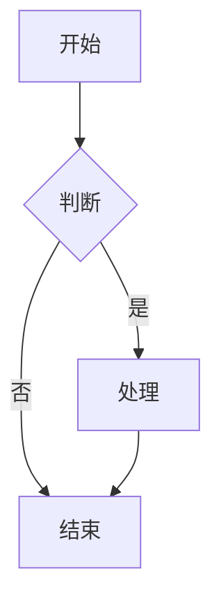
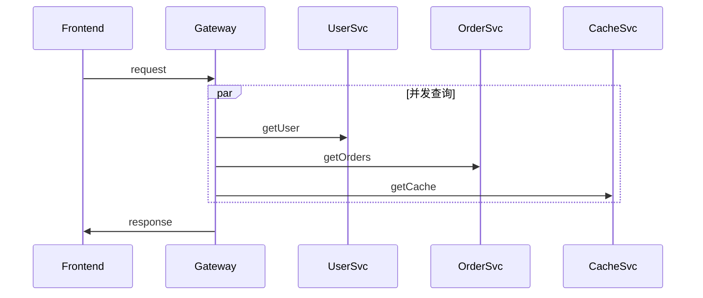

# Mermaid / PlantUML 引擎选型

飞书画板支持两种 Mermaid 渲染引擎，分别对应 `feishu-cli board import` 的两种模式：

- **`--engine server`**（默认）：飞书服务端解析渲染
- **`--engine local`**（v1.23+）：本地 `@larksuite/whiteboard-cli` 翻译 + `create-notes` 上传

两者输出结构、可编辑性、错误处理完全不同。本文档说明何时该用哪个。

---

## 选型矩阵

| 维度 | `--engine server` | `--engine local` |
|------|-------------------|------------------|
| **底层调用** | `POST /board/v1/whiteboards/<id>/nodes/plantuml` | `whiteboard-cli -t openapi` + `POST /nodes` |
| **依赖** | 仅 feishu-cli | 还需 `npm i -g @larksuite/whiteboard-cli` |
| **节点结构** | 单图作为整体（1 个 mind_map / sequence 等节点） | N 个独立 composite_shape / text_shape / connector / svg |
| **可点击编辑** | ❌ 整图不可拆，只能整张删 | ✅ 每个元素都是独立节点 |
| **par 语法** | ❌ 不支持，会报 Parse error | ✅ 支持 |
| **participant 上限** | ~10（超出可能失败） | 无限制 |
| **alt 嵌套深度** | ≤ 2 层 | 无限制 |
| **长标签（>60 字）** | ≥ 30 个时可能失败 | 无限制 |
| **失败容错** | CLI 自动重试 + 失败降级为代码块 | 单次 spawn，无重试 |
| **速度** | 1 次 HTTP，~2-5s | 翻译 ~1s + 分批上传，~5-30s（取决于节点数） |
| **画板尺寸** | 飞书自动布局 | 完全由 Mermaid 决定 |

**经验法则**：

- 标准 Mermaid（思维导图 / 时序图 / 类图 / 饼图 / 流程图 / 甘特图） → 默认 `server`
- 任何**用户报告节点要单独编辑** → `local`
- 任何**含 par / 10+ participant / 复杂嵌套 alt** → `local`
- CLI 警告"建议改 --engine local 或 svg-import" → 听话切 `local`

---

## 何时必须切到 `--engine local`

下面这些情况服务端会失败，**必须**切换：

| 触发条件 | 服务端表现 | 失败示例 |
|---------|-----------|---------|
| 含 `par...and...end` 语法 | 直接 Parse error，重试无用 | 多人并发场景的 sequenceDiagram |
| `participant` ≥ 10 | 服务端布局算法崩溃，可能返回 5XX | 复杂微服务链路图 |
| `alt` 嵌套 ≥ 3 层 | 渲染出错或超时 | 多重条件分支的流程图 |
| 长标签行 ≥ 30 | 文字布局错乱 / 截断 | 大量长文档说明的流程图 |
| 飞书返回 `Invalid request parameter` | 服务端解析失败 | （任何超出 Mermaid 子集的语法） |

---

## CLI 内置复杂度警告

feishu-cli 在 `board import --syntax mermaid --engine server`（默认）时会**自动诊断**复杂度，向 stderr 输出警告：

```bash
$ ./feishu-cli board import $BOARD_ID complex_seq.mmd --syntax mermaid
⚠ Mermaid 复杂度警告: 含 par 语法 2 次（飞书服务端不支持）
  服务端可能渲染失败，建议改 --engine local 或改用 svg-import
```

检测维度（见 `cmd/import_diagram.go` 的 `estimateMermaidComplexity`）：

- `par ` 出现次数 → ≥ 1 立即警告
- `participant` 出现次数 → ≥ 10 警告
- `alt ` / `\nalt` 出现次数 → ≥ 3 警告
- 长行（>60 字符）数 → ≥ 30 警告

警告**不阻断执行**，只是 stderr 提示。如果坚持 server，失败后会自动降级为代码块（保留源码不丢失）。

---

## 实例对比

### 示例 1：标准 flowchart（两种引擎都 OK）



| 引擎 | 节点数 | 类型分布 |
|------|--------|---------|
| server | 1（flow_chart 整体节点） | flow_chart: 1 |
| local | 8 | composite_shape: 4, connector: 4 |

如果只需要展示，`server` 更轻量；如果需要后续编辑（改色 / 改文字 / 拖动），用 `local`。

### 示例 2：含 par 的 sequenceDiagram（必须 local）



- `server`：直接返回 `Parse error: par ...`
- `local`：whiteboard-cli 解析 par 为多条平行 lifeline，正确翻译为多个 connector + text_shape

### 示例 3：架构图（建议直接走路径 E 或 SVG）

如果是 6 个微服务 + 数据库 + 队列的架构图，**不要**用 Mermaid（即使能渲染，布局也不好看）：

- 推荐 1：手写 nodes.json 用 `create-notes` 精排（路径 E）
- 推荐 2：Python 程序化生成 SVG（极坐标 / 分层）后用 `svg_to_board.py`（路径 C）

---

## 安装本地引擎

```bash
npm i -g @larksuite/whiteboard-cli
whiteboard-cli --version    # 0.2.x +
```

注意：
- 包大小约 31.5 MB（含内嵌 Noto Sans SC 字体 21 MB）
- 私有包，无源码可读，但 CLI 接口稳定
- 不需要任何 token，纯本地翻译

---

## 本地引擎工作原理

```
feishu-cli board import <id> diagram.mmd --syntax mermaid --engine local
       │
       ▼
WhiteboardCLIBridgeAvailable()   ← 检查 whiteboard-cli 在 PATH 中
       │
       ▼
RenderDiagramToOpenAPINodes(source, "mermaid", asFile=true)
       │
       │   1. tempfile 写入源码（如不是文件路径）
       │   2. spawn: whiteboard-cli -i <input> -t openapi -o <tmp.json>
       │   3. 解析输出 JSON，归一化为节点数组
       ▼
client.CreateBoardNodes(boardID, nodesJSON, ...)
       │
       │   注意：CLI 不自动修 z_index / 不修剪 viewBox 溢出
       │   如需 3 大陷阱修复，请用 scripts/svg_to_board.py
       ▼
打印 node_ids + count
```

**注意**：`board import --engine local` 不像 `scripts/svg_to_board.py` 那样自动修 z_index 和裁剪溢出节点。如果你发现渲染异常，先看 `references/pitfalls.md`，或改用 `scripts/svg_to_board.py` 处理 SVG/DSL。

---

## 失败降级策略

`feishu-cli doc import xxx.md` 自动处理 Markdown 中的 ```mermaid 块：

1. **Phase 1**：顺序创建 N 个画板占位块
2. **Phase 2**：并发 worker（默认 5）调用 ImportDiagram（server engine）
3. **Phase 3**：失败的图表自动降级为代码块（删空画板块 + 插原文 code block）

如果你想在 Markdown 里强制走 local engine，目前没有 fence flag，需要：
- 把 ```mermaid 改为 ```svg fence + 自己用 Python 把 Mermaid 渲染成 SVG（不推荐，绕得太远）
- 或者：先用 `doc create` 建文档 + `doc add-board` 加画板 + `board import --engine local` 单张处理

---

## 一句话总结

| 场景 | 用什么 |
|------|-------|
| 标准 Mermaid，展示用 | `server`（默认） |
| 复杂 Mermaid，必须单独编辑节点 | `local` |
| par / 10+ participant / 30+ 长标签 | `local`（CLI 会自动警告） |
| 不是 Mermaid 表达不出的视觉 | 改走路径 C：SVG → 原生节点 |
