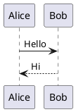

# 飞书 Markdown 兼容指南

生成将导入飞书的 Markdown 前，按本指南检查。执行导入用 `feishu-cli-import`，编辑已有文档用 `feishu-cli-write`。

## 快速检查

| 内容 | 必检项 |
|---|---|
| Mermaid | 禁花括号标签、禁 `par...and...end`、sequenceDiagram participant ≤ 8 |
| PlantUML | 无行首缩进、无 `skinparam`/`!define`、类图不写 `+ - # ~` 可见性 |
| 表格 | 行 > 9 可导入同一 block；列 > 9 会拆列组；超大表建议 Sheet |
| 图片 | `doc import` 默认上传；`doc add/content-update` 需传 `--upload-images` |
| 公式 | 行内 `$...$`；块级公式会以 Text+Equation 元素导入 |
| Callout | 仅 NOTE/WARNING/TIP/CAUTION/IMPORTANT/SUCCESS |

## Mermaid

推荐 Mermaid；飞书服务端支持 8 类常见图。

| 类型 | 声明 | 导入策略 |
|---|---|---|
| 流程图 | `flowchart TD` / `flowchart LR` | `doc import` 自动；`board import --diagram-type flowchart` |
| 时序图 | `sequenceDiagram` | `doc import` 自动；复杂图建议拆分 |
| 类图 | `classDiagram` | `board import --diagram-type class` |
| 状态图 | `stateDiagram-v2` | `doc import` auto；`board import --diagram-type state` |
| ER 图 | `erDiagram` | `board import --diagram-type er` |
| 甘特图 | `gantt` | auto |
| 饼图 | `pie` | auto |
| 思维导图 | `mindmap` | `board import --diagram-type mindmap` |

强制规则：

1. Flowchart 标签不要写 `{}`。`A{判断}` 可以表达菱形，但标签文本里不要包含花括号。
2. sequenceDiagram 不用 `par...and...end`，改成 `Note over A,B: 并行执行`。
3. sequenceDiagram 参与者建议 ≤ 8，`alt/opt/loop` 不要嵌套太深。
4. 长标签换短句，避免 30+ 长消息叠加复杂结构。
5. 状态图必须用 `stateDiagram-v2`。

更多细节见 `references/mermaid-spec.md`。

## PlantUML

仅在 Mermaid 不覆盖的图类型使用 PlantUML。



规则：

- 必须有 `@startuml` / `@enduml`。
- 不要使用行首缩进。
- 避免 `skinparam`、宏、颜色、字体、方向控制。
- 类图成员写 `field : type`、`method()`，不要写 `+field`、`-method()`。

## 表格

普通 Markdown 表格可以导入 docx：

- 行数 > 9：CLI 用 `insert_table_row` 追加到同一个 table block。
- 列数 > 9：按列组拆分，保留首列用于识别行。
- 数据表、长表和需要排序筛选的内容优先生成 Sheet：`feishu-cli sheet import-md`。

## Callout

```markdown
> [!NOTE]
> 普通提示

> [!WARNING]
> 风险提示
```

支持：`NOTE`、`WARNING`、`TIP`、`CAUTION`、`IMPORTANT`、`SUCCESS`。Callout 内可包含段落和列表。

## 图片与文件

```markdown


```

`doc import` 默认上传本地和网络图片。`doc add/content-update` 要显式传 `--upload-images`。视频/文件类精确插入用 `feishu-cli doc media-insert`。

## 扩展标签

导出再导入时会出现这些标签，导入端支持 roundtrip：

```html
<mention-user id="ou_xxx"/>
<mention-doc token="doc_token_xxx" type="docx">标题</mention-doc>
<callout type="NOTE">内容</callout>
<grid cols="2"><column>左</column><column>右</column></grid>
<sheet rows="5" cols="5"/>
```

手写时只使用自己确实需要的标签；普通内容优先标准 Markdown。

## 导入前验证

1. 文件必须是 UTF-8，且不包含 U+FFFD 替换字符。
2. Mermaid/PlantUML 先按上方规则扫一遍。
3. 图片路径要能从 Markdown 文件所在目录解析。
4. 超大表格改 Sheet，避免文档导入耗时过长。
