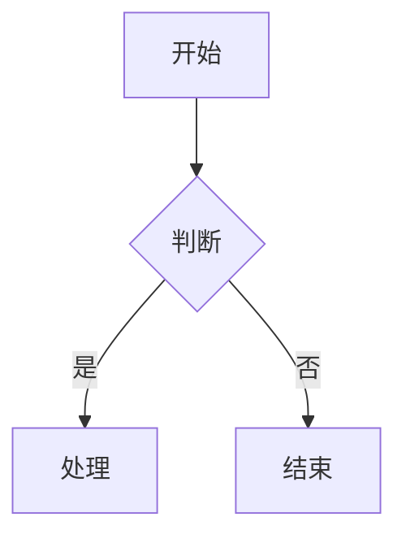
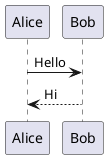

# 飞书文档写入技能

创建或更新飞书云文档，通过 Markdown 作为中间格式。**支持 Mermaid/PlantUML 图表自动转飞书画板**。

> **feishu-cli**：如尚未安装，请前往 [riba2534/feishu-cli](https://github.com/riba2534/feishu-cli) 获取安装方式。
>
> **前置条件**：使用 App Token（应用身份），只需配置 `FEISHU_APP_ID` 和 `FEISHU_APP_SECRET`（环境变量或 config.yaml），无需 `auth login`。

## 快速创建空白文档

最简方式创建一个新的飞书云文档：

```bash
feishu-cli doc create --title "文档标题" --output json
```

创建后**必须立即**：
1. 授予 `full_access` 权限：
   ```bash
   feishu-cli perm add <document_id> --doc-type docx --member-type email --member-id user@example.com --perm full_access --notification
   ```
2. 转移文档所有权：
   ```bash
   feishu-cli perm transfer-owner <document_id> --doc-type docx --member-type email --member-id user@example.com --notification
   ```
3. 发送飞书消息通知用户文档已创建

## 核心概念

**Markdown 作为中间态**：本地文档与飞书云文档之间通过 Markdown 格式进行转换，中间文件存储在 `/tmp` 目录中。

> **CRITICAL: 禁止对已有文档全量覆盖**
>
> **绝对禁止**对已有文档使用 `doc import --document-id <id>` 全量覆盖！这会：
> - 丢失所有划词评论（inline comments）
> - 破坏画板/白板引用（变成空占位块）
> - 丢失用户手动编辑的格式和内容
>
> 更新已有文档**必须使用增量方式**：`doc add`（追加）、`doc update`（修改块）、`doc delete`（删除块）。
> `doc import --document-id` 仅允许在用户**明确要求全量替换**时使用。

## 使用方法

```bash
# 创建新文档
/feishu-write "文档标题"

# 更新已有文档
/feishu-write <document_id>
```

## 执行流程

### 创建新文档

1. **收集内容**
   - 与用户确认文档标题
   - 收集用户提供的内容或根据对话生成内容

2. **生成 Markdown**
   - 在 `/tmp/feishu_write_<timestamp>.md` 创建 Markdown 文件
   - 使用标准 Markdown 语法
   - **编码验证（防御性检查）**：文件写入后，运行 `python3 -c "d=open('<file.md>','rb').read(); assert b'\\xef\\xbf\\xbd' not in d, 'U+FFFD found'; d.decode('utf-8')"` 同时检查 U+FFFD 替换字符和非法 UTF-8 字节。如果报错，**必须修复后再导入飞书**

3. **导入到飞书**
   ```bash
   feishu-cli doc import /tmp/feishu_write_<timestamp>.md --title "文档标题"
   ```

4. **添加权限**（可选，给指定用户添加 full_access）
   `full_access` 是最高权限，包含：管理协作者、编辑内容、管理文档设置（复制/移动/删除）、查看历史版本、导出等全部能力。
   ```bash
   feishu-cli perm add <document_id> --doc-type docx --member-type email --member-id user@example.com --perm full_access
   ```

5. **通知用户**
   - 提供文档链接
   - 发送飞书消息通知

### 更新已有文档（增量更新）

**原则**：只修改需要变更的部分，保留其余内容不动。**优先使用 `content-update` 命令**，一条命令精准定位并替换。

> **CRITICAL: 修改文档时禁止使用 append 模式**
>
> 当用户要求"修改"、"更新"、"替换"、"编辑"文档中某段内容时，**必须使用 `replace_range`
> 或 `replace_all` 模式**，精准定位并替换目标内容。
>
> **禁止**将整个文档内容重新 Append 到末尾！这会导致文档内容重复。
> `append` 模式**仅在**用户明确要求"追加新内容"、"在末尾加一段"时使用。

#### 决策树（按用户意图选择模式）

| 用户意图 | 推荐命令 | 说明 |
|---------|---------|------|
| 替换/修改/更新某个章节 | `content-update --mode replace_range` | **最常用**，按标题定位后原地替换 |
| 在某个章节前/后插入新内容 | `content-update --mode insert_before/insert_after` | 精准插入，不影响已有内容 |
| 全文查找替换所有匹配 | `content-update --mode replace_all` | 批量替换 |
| 删除某个章节 | `content-update --mode delete_range` | 精准删除 |
| 在文档末尾追加新内容 | `content-update --mode append` | **仅追加**新内容时使用 |
| 完全重写文档 | `content-update --mode overwrite` | 慎用，会丢失评论和画板 |

**关键规则**：
- 用户说"修改/更新/替换/编辑某个章节" → **必须用 `replace_range`**，禁止用 append
- 用户说"添加/追加/新增内容到末尾" → 用 `append`
- 用户说"在某处插入" → 用 `insert_before` 或 `insert_after`
- 用户说"删除某段内容" → 用 `delete_range`

#### 场景 A：替换某个章节（最常用）

```bash
# 按标题定位并替换（从 H2 标题到下一个 H2，一条命令完成）
feishu-cli doc content-update <document_id> --mode replace_range \
  --selection-by-title "## 旧章节标题" \
  --markdown-file /tmp/feishu_new_section.md

# 也可以直接传 markdown 内容
feishu-cli doc content-update <document_id> --mode replace_range \
  --selection-by-title "## 旧章节标题" \
  --markdown "## 新章节标题\n\n更新后的内容"
```

#### 场景 B：在文档指定位置插入内容

```bash
# 在"目标章节"后面插入新内容
feishu-cli doc content-update <document_id> --mode insert_after \
  --selection-by-title "## 目标章节" \
  --markdown-file /tmp/feishu_insert.md

# 在"目标章节"前面插入新内容
feishu-cli doc content-update <document_id> --mode insert_before \
  --selection-by-title "## 目标章节" \
  --markdown "## 新增章节\n\n插入的内容"
```

#### 场景 C：在文档末尾追加新内容

仅在确实需要追加新内容到末尾时使用：

```bash
cat > /tmp/feishu_append.md << 'EOF'
## 新增章节标题

新增的内容...
EOF

feishu-cli doc content-update <document_id> --mode append \
  --markdown-file /tmp/feishu_append.md
```

#### 场景 D：删除指定章节

```bash
# 按标题定位并删除整个章节
feishu-cli doc content-update <document_id> --mode delete_range \
  --selection-by-title "## 废弃章节"

# 按内容范围定位并删除
feishu-cli doc content-update <document_id> --mode delete_range \
  --selection-with-ellipsis "开始段落...结束段落"
```

#### 场景 E：全文查找替换

```bash
# 替换所有匹配的块
feishu-cli doc content-update <document_id> --mode replace_all \
  --selection-with-ellipsis "旧文本" \
  --markdown "新文本"
```

#### 场景 F：修改单个块的内容（低级 API）

仅在需要精确控制单个块时使用：

```bash
# 1. 获取文档块结构，找到要修改的 block_id
feishu-cli doc blocks <document_id>

# 2. 更新指定块
feishu-cli doc update <document_id> <block_id> \
  --content '{"update_text_elements":{"elements":[{"text_run":{"content":"更新后的文本"}}]}}'
```

> **何时允许全量覆盖**：仅当用户明确说"重写整个文档"、"全量替换"时，才可使用
> `content-update --mode overwrite` 或 `doc import --document-id <id>`。默认必须增量更新。

## 支持的 Markdown 语法

| 语法 | 飞书块类型 | 说明 |
|------|-----------|------|
| `# 标题` | Heading1-6 | |
| `普通文本` | Text | |
| `- 列表项` | Bullet | 支持缩进嵌套 |
| `1. 有序项` | Ordered | 支持缩进嵌套 |
| `- [ ] 任务` | Todo | |
| `` ```code``` `` | Code | |
| `` ```mermaid``` `` | **Board（画板）** | **推荐使用** |
| `` ```plantuml``` `` / `` ```puml``` `` | **Board（画板）** | PlantUML 图表 |
| `> 引用` | QuoteContainer | 支持嵌套引用 |
| `> [!NOTE]` 等 | **Callout（高亮块）** | 6 种类型 |
| `---` | Divider | |
| `**粗体**` | 粗体样式 | |
| `*斜体*` | 斜体样式 | |
| `~~删除线~~` | 删除线样式 | |
| `<u>下划线</u>` | 下划线样式 | |
| `` `行内代码` `` | 行内代码样式 | |
| `$公式$` | **行内公式** | 支持一段多个公式 |
| `$$公式$$` | **块级公式** | 独立公式行 |
| `[链接](url)` | 链接 | |
| `| 表格 |` | Table | 行 > 9 通过 `insert_table_row` API 追加保持单 block；列 > 9 按列组拆分保留首列；列宽自动计算 |

### 推荐：使用 Mermaid / PlantUML 画图

在文档中画图时，**推荐使用 Mermaid**（也支持 PlantUML），会自动转换为飞书画板。

支持的 Mermaid 图表类型：
- ✅ flowchart（流程图，支持 subgraph）
- ✅ sequenceDiagram（时序图）
- ✅ classDiagram（类图）
- ✅ stateDiagram-v2（状态图）
- ✅ erDiagram（ER 图）
- ✅ gantt（甘特图）
- ✅ pie（饼图）
- ✅ mindmap（思维导图）

**Mermaid 限制（必须遵守，否则导入失败）**：
- ❌ 禁止在 flowchart 节点标签中使用 `{}` 花括号（如 `{version}`），会触发解析错误
- ❌ 禁止使用 `par...and...end` 语法，飞书解析器完全不支持
- ❌ 避免复杂度超限：10+ participant + 2+ alt 块 + 30+ 长消息标签会触发服务端 500
- ✅ 安全阈值：participant ≤ 8、alt ≤ 1、消息标签尽量简短
- ✅ `par` 替代方案：改用 `Note over X: 并行执行...`
- ✅ 导入失败的图表会自动降级为代码块展示，不会丢失内容

**示例**：

````markdown

````

````markdown

````

### Callout 高亮块

在文档中使用 Callout 语法创建飞书高亮块：

````markdown
> [!NOTE]
> 提示信息。

> [!WARNING]
> 警告信息。

> [!TIP]
> 技巧提示。

> [!CAUTION]
> 警示信息。

> [!IMPORTANT]
> 重要信息。

> [!SUCCESS]
> 成功信息。
````

Callout 内支持多行文本和子块（列表等）。

### 公式

````markdown
行内公式：圆面积 $S = \pi r^2$，周长 $C = 2\pi r$。

块级公式：
$$\int_{0}^{\infty} e^{-x^2} dx = \frac{\sqrt{\pi}}{2}$$
````

## 高级操作

### 添加画板

向文档添加空白画板：

```bash
# 在文档末尾添加画板
feishu-cli doc add-board <document_id>

# 在指定位置添加画板
feishu-cli doc add-board <document_id> --parent-id <block_id> --index 0
```

### 添加 Callout

向文档添加高亮块：

```bash
# 添加信息类型 Callout
feishu-cli doc add-callout <document_id> "提示内容" --callout-type info

# 添加警告类型 Callout
feishu-cli doc add-callout <document_id> "警告内容" --callout-type warning

# 指定位置添加
feishu-cli doc add-callout <document_id> "内容" --callout-type error --parent-id <block_id> --index 0
```

**Callout 类型与颜色映射**：

飞书 Callout 共 6 种颜色。**Markdown 导入**（`doc import`）使用 `[!TYPE]` 语法支持全部 6 种，**CLI 命令**（`doc add-callout --callout-type`）支持其中 4 种：

| 颜色 | 背景色值 | Markdown 语法 | CLI `--callout-type` |
|------|---------|--------------|---------------------|
| 蓝色 | 6 | `[!NOTE]` | `info` |
| 红色 | 2 | `[!WARNING]` | `error` |
| 橙色 | 3 | `[!CAUTION]` | — |
| 黄色 | 4 | `[!TIP]` | `warning` |
| 绿色 | 5 | `[!SUCCESS]` | `success` |
| 紫色 | 7 | `[!IMPORTANT]` | — |

> 需要橙色（CAUTION）或紫色（IMPORTANT）时，请使用 Markdown 导入方式（`doc import` 或 `doc add --content-type markdown`）。

### 表格操作

对文档内嵌表格（Block 类型 31）进行行列操作和单元格合并：

```bash
# 获取表格块 ID（查找 block_type=31 的块）
feishu-cli doc blocks DOC_ID

# 插入行（-1 表示末尾）
feishu-cli doc table insert-row DOC_ID TABLE_BLOCK_ID --index -1

# 插入列
feishu-cli doc table insert-column DOC_ID TABLE_BLOCK_ID --index 2

# 删除行（左闭右开区间）
feishu-cli doc table delete-rows DOC_ID TABLE_BLOCK_ID --start 1 --end 3

# 删除列（左闭右开区间）
feishu-cli doc table delete-columns DOC_ID TABLE_BLOCK_ID --start 0 --end 2

# 合并单元格（左闭右开区间）
feishu-cli doc table merge-cells DOC_ID TABLE_BLOCK_ID \
  --row-start 0 --row-end 2 --col-start 0 --col-end 3

# 取消合并
feishu-cli doc table unmerge-cells DOC_ID TABLE_BLOCK_ID --row 0 --col 0
```

> **注意**：`create_block` API 限制单次创建最多 9 行 × 9 列。行超出时 CLI 自动通过 `insert_table_row` API 把剩余行追加到同一 block（视觉连贯）；列超出时按列组拆分保留首列作为标识。行数极多（200+）时仍建议改用电子表格（Sheet）承载。

### 批量更新块

批量更新文档中的块内容：

```bash
# 从 JSON 文件批量更新
feishu-cli doc batch-update <document_id> --source-type content --file updates.json
```

JSON 格式示例：
```json
[
  {
    "block_id": "block_xxx",
    "block_type": 2,
    "content": "更新后的文本内容"
  }
]
```

## 输出格式

创建/更新完成后报告：
- 文档 ID
- 文档 URL：`https://feishu.cn/docx/<document_id>`
- 操作状态

## 示例

```bash
# 创建新的会议纪要
/feishu-write "2024-01-21 周会纪要"

# 更新现有文档
/feishu-write <document_id>
```

## 向文档插入图片或文件

通过 `doc media-insert` 命令向文档中插入本地图片或文件。

### 插入图片

图片采用三步法：上传素材 → 创建 Image Block → 设置对齐和描述。

```bash
# 插入图片（默认居中对齐）
feishu-cli doc media-insert <document_id> --file /path/to/image.png

# 指定对齐方式和描述
feishu-cli doc media-insert <document_id> \
  --file /path/to/screenshot.png \
  --type image \
  --align left \
  --caption "系统架构图"
```

### 插入文件

文件采用三步法：上传素材 → 创建 File Block → 关联文件。

```bash
# 插入文件附件
feishu-cli doc media-insert <document_id> \
  --file /path/to/report.pdf \
  --type file
```

### 参数说明

| 参数 | 说明 | 默认值 |
|------|------|--------|
| `<document_id>` | 文档 ID | 必填 |
| `--file` | 本地文件路径 | 必填 |
| `--type` | 插入类型 `image`/`file` | `image` |
| `--align` | 图片对齐方式 `left`/`center`/`right`（仅图片） | `center` |
| `--caption` | 图片描述（仅图片） | — |

### 两种模式的区别

| 维度 | 图片（image） | 文件（file） |
|------|--------------|-------------|
| 上传方式 | `media upload --parent-type docx_image` | `media upload --parent-type docx_file` |
| 创建块 | Image Block（block_type=27） | File Block（block_type=23） |
| 额外属性 | 支持 `--align`（对齐）和 `--caption`（描述） | 无额外属性 |
| 显示效果 | 内嵌图片显示 | 文件卡片显示 |

## 常见问题

| 问题 | 原因与解决方案 |
|------|--------------|
| Mermaid 图表导入失败 | 图表会自动降级为代码块展示，不会丢失内容。检查是否使用了 `{}` 花括号、`par...and...end` 等不支持的语法 |
| 权限添加失败 | 检查飞书开放平台中 App 是否已配置 `docs:permission.member:create` 权限，且应用已发布 |
| 认证过期（401 错误） | 重新执行 `feishu-cli auth login`（Device Flow 会自动注入 `offline_access` 获取 30 天 Refresh Token） |
| 文档创建成功但无法访问 | 确认已执行 `perm add` 授予 `full_access` 权限并 `perm transfer-owner` 转移所有权 |
| 超长表格导入耗时长 | 行 > 9 时 CLI 通过 `insert_table_row` API 逐行串行追加到同一 block（每行约 1 次 API 往返），verbose 模式每 5 行打印进度 |
| 表格被拆分为多个 block | 列 > 9 时 CLI 按列组拆分（每组 ≤ 9 列），首列作为标识在所有组中保留 |

## content-update 定位参考

> 完整的模式决策树和使用示例见上方"更新已有文档"部分。以下是定位方式的详细说明。

### 定位方式

| 参数 | 说明 | 示例 |
|------|------|------|
| `--selection-by-title` | 按标题定位，范围从该标题到下一个同级/更高级标题（或文档末尾） | `"## 章节标题"` |
| `--selection-with-ellipsis` | 按内容范围定位，`...` 分隔开头和结尾文本 | `"开头内容...结尾内容"` |

**标题定位规则**：
- `"## 标题文本"` — 匹配 H2 级别且包含"标题文本"的标题
- 范围自动延伸到下一个同级或更高级标题（或文档末尾）

**内容范围定位规则**：
- `"开头...结尾"` — 从包含"开头"的块到包含"结尾"的块（左闭右闭）
- 不含 `...` 时作为精确匹配，匹配所有包含该文本的块

### 其他参数

| 参数 | 说明 |
|------|------|
| `--markdown` | 直接传入 Markdown 内容（支持 `\n` 转义为换行） |
| `--markdown-file` | 从文件读取 Markdown 内容 |
| `--upload-images` | 上传 Markdown 中的本地图片 |
| `-o json` | JSON 格式输出 |

> `--markdown` 和 `--markdown-file` 不能同时使用。

## Markdown 扩展语法（HTML 标签）

除标准 Markdown 语法外，导入时还支持以下 HTML 标签形式的扩展语法。这些标签由导出端自动生成，支持 roundtrip（导出→导入不丢失信息）。

### @用户（MentionUser）

```html
<mention-user id="ou_xxx"/>
```

导入时创建 MentionUser 元素，`id` 为用户的 Open ID。

### @文档（MentionDoc）

```html
<mention-doc token="xxx" type="docx">文档标题</mention-doc>
```

导入时创建 MentionDoc 元素。`type` 支持：`docx`、`doc`、`sheet`、`bitable`、`mindnote`、`wiki`、`file`、`slides`。

### 分栏布局（Grid）

```html
<grid cols="2">
<column>
左栏内容（支持嵌套 Markdown）
</column>
<column>
右栏内容（支持嵌套 Markdown）
</column>
</grid>
```

导入时创建 Grid Block（type=24）+ GridColumn 子块（type=25），每个 `<column>` 内的 Markdown 递归转换。

### Callout 高亮块（HTML 标签形式）

```html
<callout type="NOTE">提示内容</callout>
```

与 `> [!NOTE]` 语法效果相同，支持 6 种类型：`NOTE`、`WARNING`、`TIP`、`CAUTION`、`IMPORTANT`、`SUCCESS`。

### 空白画板（Whiteboard）

```html
<whiteboard type="blank"/>
```

导入时创建 Board Block（type=43）。

### 电子表格（Sheet）

```html
<sheet rows="5" cols="5"/>
```

导入时创建 Sheet Block（type=30），可选 `rows`、`cols` 属性指定行列数。

### 多维表格（Bitable）

```html
<bitable view="table"/>
```

导入时创建 Bitable Block（type=18）。`view` 支持：`table`（默认）、`kanban`、`calendar`、`gallery`、`gantt`、`form`。

### 带属性图片（Image）

```html
<image token="xxx" width="800" height="600" align="center" caption="图片说明"/>
```

导入时创建 Image Block（type=27）。属性说明：
- `token`：图片素材 Token（必需）
- `width`/`height`：图片尺寸（可选）
- `align`：对齐方式 `left`/`center`/`right`（可选）
- `caption`：图片描述（可选）

> 与标准 `` 语法的区别：HTML 标签形式保留了 token、尺寸、对齐等飞书原生属性，适用于 roundtrip 场景。

### 文件块（File）

```html
<file token="xxx" name="report.pdf" view-type="1"/>
```

导入时创建 File Block（type=23）。`view-type` 控制文件卡片显示模式。
