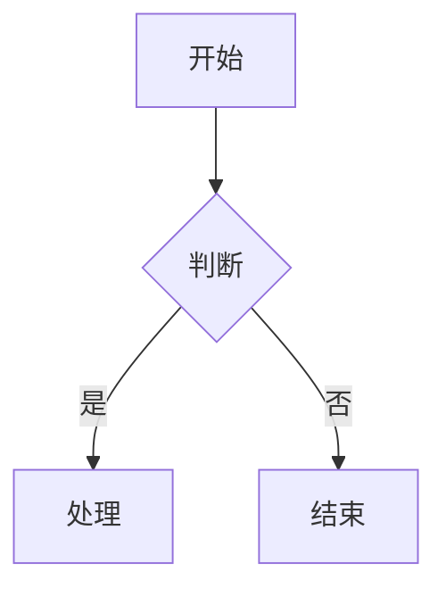
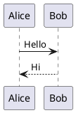

# 飞书文档写入技能

创建或更新飞书云文档，通过 Markdown 作为中间格式。**支持 Mermaid/PlantUML 图表自动转飞书画板**。

> **feishu-cli**：如尚未安装，请前往 [riba2534/feishu-cli](https://github.com/riba2534/feishu-cli) 获取安装方式。
>
> **前置条件**：使用 App Token（应用身份），只需配置 `FEISHU_APP_ID` 和 `FEISHU_APP_SECRET`（环境变量或 config.yaml），无需 `auth login`。

## 快速创建空白文档

最简方式创建一个新的飞书云文档：

```bash
feishu-cli doc create --title "文档标题" --output json
```

创建后**必须立即**：
1. 授予 `full_access` 权限：
   ```bash
   feishu-cli perm add <document_id> --doc-type docx --member-type email --member-id user@example.com --perm full_access --notification
   ```
2. 转移文档所有权：
   ```bash
   feishu-cli perm transfer-owner <document_id> --doc-type docx --member-type email --member-id user@example.com --notification
   ```
3. 发送飞书消息通知用户文档已创建

## 核心概念

**Markdown 作为中间态**：本地文档与飞书云文档之间通过 Markdown 格式进行转换，中间文件存储在 `/tmp` 目录中。

> **CRITICAL: 禁止对已有文档全量覆盖**
>
> **绝对禁止**对已有文档使用 `doc import --document-id <id>` 全量覆盖！这会：
> - 丢失所有划词评论（inline comments）
> - 破坏画板/白板引用（变成空占位块）
> - 丢失用户手动编辑的格式和内容
>
> 更新已有文档**必须使用增量方式**：`doc add`（追加）、`doc update`（修改块）、`doc delete`（删除块）。
> `doc import --document-id` 仅允许在用户**明确要求全量替换**时使用。

## 使用方法

```bash
# 创建新文档
/feishu-write "文档标题"

# 更新已有文档
/feishu-write <document_id>
```

## 执行流程

### 创建新文档

1. **收集内容**
   - 与用户确认文档标题
   - 收集用户提供的内容或根据对话生成内容

2. **生成 Markdown**
   - 在 `/tmp/feishu_write_<timestamp>.md` 创建 Markdown 文件
   - 使用标准 Markdown 语法

3. **导入到飞书**
   ```bash
   feishu-cli doc import /tmp/feishu_write_<timestamp>.md --title "文档标题"
   ```

4. **添加权限**（可选，给指定用户添加 full_access）
   `full_access` 是最高权限，包含：管理协作者、编辑内容、管理文档设置（复制/移动/删除）、查看历史版本、导出等全部能力。
   ```bash
   feishu-cli perm add <document_id> --doc-type docx --member-type email --member-id user@example.com --perm full_access
   ```

5. **通知用户**
   - 提供文档链接
   - 发送飞书消息通知

### 更新已有文档（增量更新）

**原则**：只修改需要变更的部分，保留其余内容不动。

#### 场景 A：在文档末尾追加内容

最常见的场景。直接用 `doc add` 以 Markdown 格式追加：

```bash
# 1. 准备要追加的内容（只写新增部分，不要包含已有内容）
cat > /tmp/feishu_append.md << 'EOF'
## 新增章节标题

新增的内容...
EOF

# 2. 追加到文档末尾
feishu-cli doc add <document_id> /tmp/feishu_append.md --content-type markdown
```

#### 场景 B：在文档指定位置插入内容

```bash
# 1. 获取文档块结构，找到插入点
feishu-cli doc blocks <document_id>

# 2. 在指定父块的指定位置插入
feishu-cli doc add <document_id> /tmp/feishu_insert.md \
  --content-type markdown \
  --block-id <parent_block_id> \
  --index <position>
```

#### 场景 C：修改已有块的内容

```bash
# 1. 获取文档块结构，找到要修改的 block_id
feishu-cli doc blocks <document_id>

# 2. 更新指定块
feishu-cli doc update <document_id> <block_id> \
  --content '{"update_text_elements":{"elements":[{"text_run":{"content":"更新后的文本"}}]}}'
```

#### 场景 D：删除指定范围的块

```bash
# 删除父块下索引 2~4 的子块
feishu-cli doc delete <document_id> <parent_block_id> --start 2 --end 5

# 删除父块下所有子块
feishu-cli doc delete <document_id> <parent_block_id> --all
```

#### 场景 E：替换某个章节

先删除旧章节的块，再在同一位置插入新内容：

```bash
# 1. 获取块结构，定位章节的块范围
feishu-cli doc blocks <document_id>

# 2. 删除旧章节（假设在父块下索引 5~8）
feishu-cli doc delete <document_id> <parent_block_id> --start 5 --end 9 -f

# 3. 在同一位置插入新内容
feishu-cli doc add <document_id> /tmp/feishu_new_section.md \
  --content-type markdown \
  --block-id <parent_block_id> \
  --index 5
```

> **何时允许全量覆盖**：仅当用户明确说"重写整个文档"、"全量替换"时，才可使用
> `feishu-cli doc import /tmp/file.md --document-id <id>`。默认必须增量更新。

## 支持的 Markdown 语法

| 语法 | 飞书块类型 | 说明 |
|------|-----------|------|
| `# 标题` | Heading1-6 | |
| `普通文本` | Text | |
| `- 列表项` | Bullet | 支持缩进嵌套 |
| `1. 有序项` | Ordered | 支持缩进嵌套 |
| `- [ ] 任务` | Todo | |
| `` ```code``` `` | Code | |
| `` ```mermaid``` `` | **Board（画板）** | **推荐使用** |
| `` ```plantuml``` `` / `` ```puml``` `` | **Board（画板）** | PlantUML 图表 |
| `> 引用` | QuoteContainer | 支持嵌套引用 |
| `> [!NOTE]` 等 | **Callout（高亮块）** | 6 种类型 |
| `---` | Divider | |
| `**粗体**` | 粗体样式 | |
| `*斜体*` | 斜体样式 | |
| `~~删除线~~` | 删除线样式 | |
| `<u>下划线</u>` | 下划线样式 | |
| `` `行内代码` `` | 行内代码样式 | |
| `$公式$` | **行内公式** | 支持一段多个公式 |
| `$$公式$$` | **块级公式** | 独立公式行 |
| `[链接](url)` | 链接 | |
| `| 表格 |` | Table | 超过 9 行或 9 列自动拆分，列拆分保留首列，列宽自动计算 |

### 推荐：使用 Mermaid / PlantUML 画图

在文档中画图时，**推荐使用 Mermaid**（也支持 PlantUML），会自动转换为飞书画板。

支持的 Mermaid 图表类型：
- ✅ flowchart（流程图，支持 subgraph）
- ✅ sequenceDiagram（时序图）
- ✅ classDiagram（类图）
- ✅ stateDiagram-v2（状态图）
- ✅ erDiagram（ER 图）
- ✅ gantt（甘特图）
- ✅ pie（饼图）
- ✅ mindmap（思维导图）

**Mermaid 限制（必须遵守，否则导入失败）**：
- ❌ 禁止在 flowchart 节点标签中使用 `{}` 花括号（如 `{version}`），会触发解析错误
- ❌ 禁止使用 `par...and...end` 语法，飞书解析器完全不支持
- ❌ 避免复杂度超限：10+ participant + 2+ alt 块 + 30+ 长消息标签会触发服务端 500
- ✅ 安全阈值：participant ≤ 8、alt ≤ 1、消息标签尽量简短
- ✅ `par` 替代方案：改用 `Note over X: 并行执行...`
- ✅ 导入失败的图表会自动降级为代码块展示，不会丢失内容

**示例**：

````markdown

````

````markdown

````

### Callout 高亮块

在文档中使用 Callout 语法创建飞书高亮块：

````markdown
> [!NOTE]
> 提示信息。

> [!WARNING]
> 警告信息。

> [!TIP]
> 技巧提示。

> [!CAUTION]
> 警示信息。

> [!IMPORTANT]
> 重要信息。

> [!SUCCESS]
> 成功信息。
````

Callout 内支持多行文本和子块（列表等）。

### 公式

````markdown
行内公式：圆面积 $S = \pi r^2$，周长 $C = 2\pi r$。

块级公式：
$$\int_{0}^{\infty} e^{-x^2} dx = \frac{\sqrt{\pi}}{2}$$
````

## 高级操作

### 添加画板

向文档添加空白画板：

```bash
# 在文档末尾添加画板
feishu-cli doc add-board <document_id>

# 在指定位置添加画板
feishu-cli doc add-board <document_id> --parent-id <block_id> --index 0
```

### 添加 Callout

向文档添加高亮块：

```bash
# 添加信息类型 Callout
feishu-cli doc add-callout <document_id> "提示内容" --callout-type info

# 添加警告类型 Callout
feishu-cli doc add-callout <document_id> "警告内容" --callout-type warning

# 指定位置添加
feishu-cli doc add-callout <document_id> "内容" --callout-type error --parent-id <block_id> --index 0
```

**Callout 类型与颜色映射**：

飞书 Callout 共 6 种颜色。**Markdown 导入**（`doc import`）使用 `[!TYPE]` 语法支持全部 6 种，**CLI 命令**（`doc add-callout --callout-type`）支持其中 4 种：

| 颜色 | 背景色值 | Markdown 语法 | CLI `--callout-type` |
|------|---------|--------------|---------------------|
| 蓝色 | 6 | `[!NOTE]` | `info` |
| 红色 | 2 | `[!WARNING]` | `error` |
| 橙色 | 3 | `[!CAUTION]` | — |
| 黄色 | 4 | `[!TIP]` | `warning` |
| 绿色 | 5 | `[!SUCCESS]` | `success` |
| 紫色 | 7 | `[!IMPORTANT]` | — |

> 需要橙色（CAUTION）或紫色（IMPORTANT）时，请使用 Markdown 导入方式（`doc import` 或 `doc add --content-type markdown`）。

### 批量更新块

批量更新文档中的块内容：

```bash
# 从 JSON 文件批量更新
feishu-cli doc batch-update <document_id> --source-type content --file updates.json
```

JSON 格式示例：
```json
[
  {
    "block_id": "block_xxx",
    "block_type": 2,
    "content": "更新后的文本内容"
  }
]
```

## 输出格式

创建/更新完成后报告：
- 文档 ID
- 文档 URL：`https://feishu.cn/docx/<document_id>`
- 操作状态

## 示例

```bash
# 创建新的会议纪要
/feishu-write "2024-01-21 周会纪要"

# 更新现有文档
/feishu-write <document_id>
```

## 常见问题

| 问题 | 原因与解决方案 |
|------|--------------|
| Mermaid 图表导入失败 | 图表会自动降级为代码块展示，不会丢失内容。检查是否使用了 `{}` 花括号、`par...and...end` 等不支持的语法 |
| 权限添加失败 | 检查飞书开放平台中 App 是否已配置 `docs:permission.member:create` 权限，且应用已发布 |
| 认证过期（401 错误） | 重新执行 `feishu-cli auth login`，建议包含 `offline_access` scope 以获取 30 天 Refresh Token |
| 文档创建成功但无法访问 | 确认已执行 `perm add` 授予 `full_access` 权限并 `perm transfer-owner` 转移所有权 |
| 表格内容显示不全 | 飞书 API 单个表格限制 9 行 9 列，超出部分会自动拆分为多个表格，属于正常行为 |
